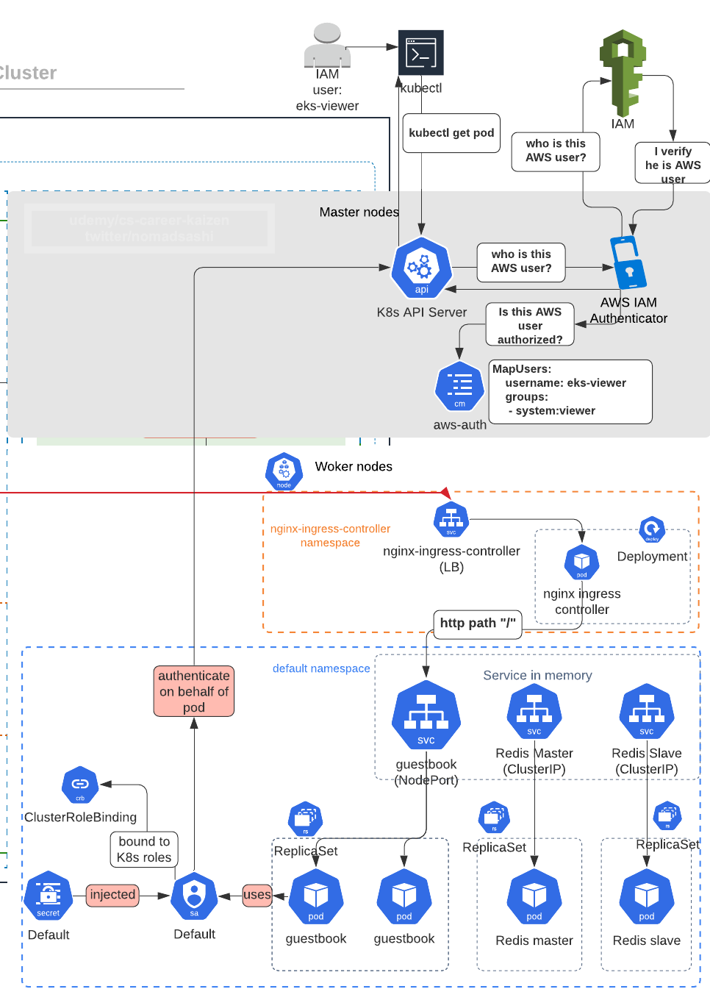
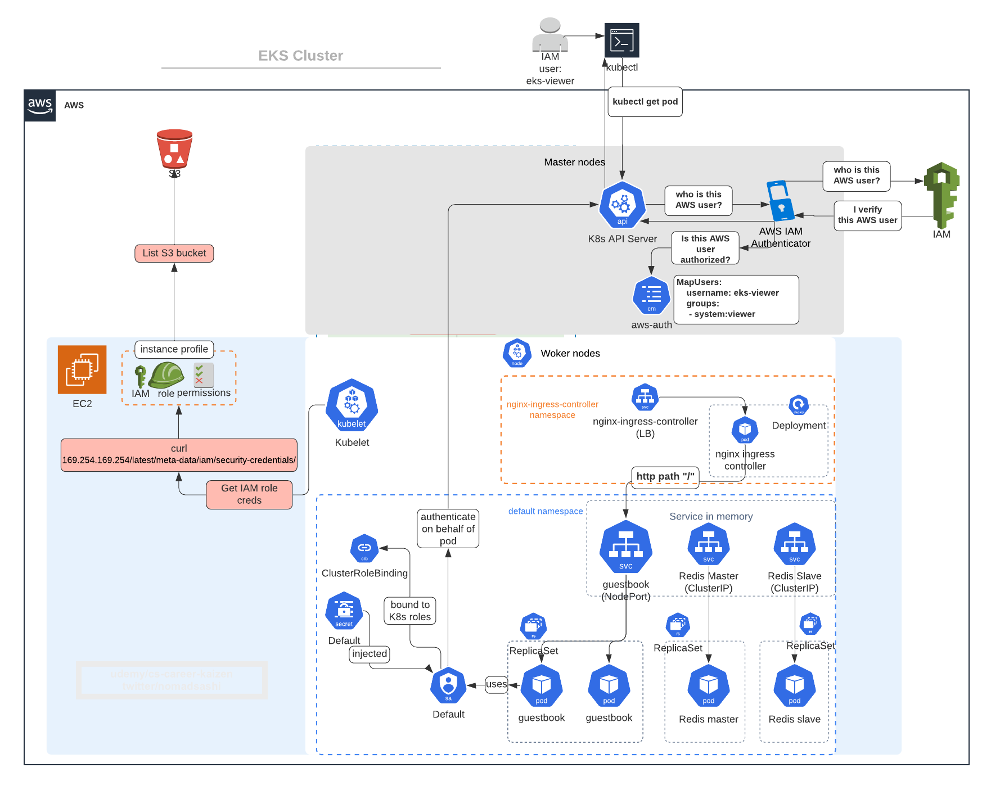
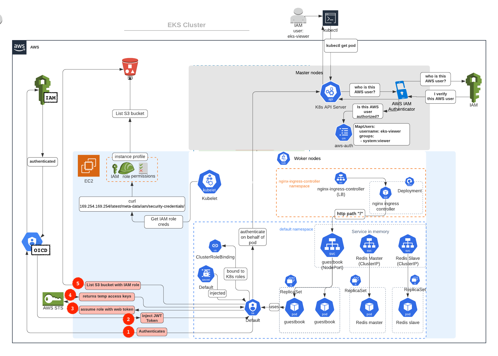
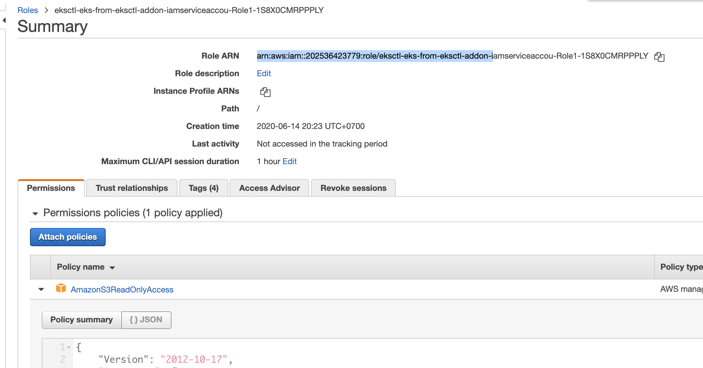

# 10. (BEST PRACTICE) Security: App (pod-level) Authorization to AWS resources using IRSA (kube2iam is outdated)


# 1. Recap of Pod Authentication within K8s cluster using Service Account



1. pod is associated with a service account, and a credential (token) for that service account is placed into the filesystem each container in that pod, at `/var/run/secrets/kubernetes.io/serviceaccount/token`
2. Pods can authenticate with API server using an auto-mounted token in the default service account and secret that only the Kubernetes API server could validate. 


# 2. Recap of Pod Authorization to AWS Resources using EKS Node's Instance Profile



1. Pod runs on EKS worker nodes, which have AWS IAM instance profile attached to them.
2. kubelet agent in worker nodes get temporary IAM credentials from IAM role attached to worker nodes through instance metadata at `169.254.169.254/latest/meta-data/iam/security-credentials/IAM_ROLE_NAME`

```
kubectl run --image curlimages/curl --restart Never --command curl -- /bin/sh -c "sleep 500"
```


# 3. IRSA Architecture Overview

ref: https://aws.amazon.com/blogs/opensource/introducing-fine-grained-iam-roles-service-accounts/




1. When you launch a pod with `kubectl apply -f`, the YAML manifest is submitted to the API server with the Amazon EKS Pod Identity webhook configured
2. Because the service account `irsa-service-account` has an eks.amazonaws.com/role-arn annotation, the webhook __injects the necessary environment variables (AWS_ROLE_ARN and AWS_WEB_IDENTITY_TOKEN_FILE)__ and sets up the __aws-iam-token projected volume__ (this is not IAM credentials, just JWT token) in the pod that the job supervises.
3. Service accoount associated with the pod authenticate to OIDC (which in turns authenticate to AWS IAM service on behalf of service account) and get JWT token back from OIDC and saves it in `AWS_WEB_IDENTITY_TOKEN_FILE`
4. When container executes `aws s3 ls`, the pod performs an `sts:assume-role-with-web-identity` with the token stored in `AWS_WEB_IDENTITY_TOKEN_FILE` path to __assume the IAM role__ (behind the scene,). It receives temporary credentials that it uses to complete the S3 write operation.


# setup 1: Create IAM assumable role which specifies namespace and service account, and OIDC endpoint

With `eksctl create cluster`, OIDC proviser URL is already created so you can skip this:
```bash
# get the cluster’s identity issuer URL
ISSUER_URL=$(aws eks describe-cluster \
                       --name eks-from-eksctl \
                       --query cluster.identity.oidc.issuer \
                       --output text)

# create OIDC provider
aws iam create-open-id-connect-provider \
          --url $ISSUER_URL \
          --thumbprint-list $ROOT_CA_FINGERPRINT \
          --client-id-list sts.amazonaws.com
```


Associate OIDC provider with cluster
```bash
eksctl utils associate-iam-oidc-provider \
            --region=us-west-2 \
            --cluster=eks-from-eksctl \
            --approve

# output
[ℹ]  eksctl version 0.21.0
[ℹ]  using region us-west-2
[ℹ]  will create IAM Open ID Connect provider for cluster "eks-from-eksctl" in "us-west-2"
[✔]  created IAM Open ID Connect provider for cluster "eks-from-eksctl" in "us-west-2"
```

# setup 2: Annotate k8s service account with IAM role ARN

1. creates an IAM role and attaches the specified policy to it, in our case `arn:aws:iam::aws:policy/AmazonS3ReadOnlyAccess`.
2. creates a Kubernetes service account, `irsa-service-account` here, and annotates the service account with the IAM role.

```bash
eksctl create iamserviceaccount \
                --name irsa-service-account \
                --namespace default \
                --cluster eks-from-eksctl \
                --attach-policy-arn arn:aws:iam::aws:policy/AmazonS3ReadOnlyAccess \
                --approve \
                --region us-west-2

# output
[ℹ]  eksctl version 0.21.0
[ℹ]  using region us-west-2
[ℹ]  1 iamserviceaccount (default/irsa-service-account) was included (based on the include/exclude rules)
[!]  serviceaccounts that exists in Kubernetes will be excluded, use --override-existing-serviceaccounts to override
[ℹ]  1 task: { 2 sequential sub-tasks: { create IAM role for serviceaccount "default/irsa-service-account", create serviceaccount "default/irsa-service-account" } }
[ℹ]  building iamserviceaccount stack "eksctl-eks-from-eksctl-addon-iamserviceaccount-default-irsa-service-account"
[ℹ]  deploying stack "eksctl-eks-from-eksctl-addon-iamserviceaccount-default-irsa-service-account"
[ℹ]  created serviceaccount "default/irsa-service-account"
```

You can see a new IAM role `eksctl-eks-from-eksctl-addon-iamserviceaccou-Role1-1S8X0CMRPPPLY` created in Console.




You can also see details of service account `irsa-service-account`
```bash
$ kubectl describe serviceaccount irsa-service-account

# output
Name:                irsa-service-account
Namespace:           default
Labels:              <none>
Annotations:         eks.amazonaws.com/role-arn: arn:aws:iam::xxxxxx:role/eksctl-eks-from-eksctl-addon-iamserviceaccou-Role1-1S8X0CMRPPPLY  # <--- IAM Role ARN is annotated here
Image pull secrets:  <none>
Mountable secrets:   irsa-service-account-token-qcjzn
Tokens:              irsa-service-account-token-qcjzn
Events:              <none>
```

# setup 3: Reference service account from Pod yaml

Create a deployment yaml which uses `aws/aws-cli` docker image and `irsa-service-account` service account
```bash
kubectl run irsa-iam-test \
    --image amazon/aws-cli  \
    --serviceaccount irsa-service-account \
    --dry-run -o yaml \
    --command -- /bin/sh -c "sleep 500" \
    > deployment_irsa_test.yaml
```

[deployment_irsa_test.yaml](deployment_irsa_test.yaml)
```yaml
apiVersion: apps/v1
kind: Deployment
metadata:
  creationTimestamp: null
  labels:
    run: irsa-iam-test
  name: irsa-iam-test
spec:
  replicas: 1
  selector:
    matchLabels:
      run: irsa-iam-test
  strategy: {}
  template:
    metadata:
      creationTimestamp: null
      labels:
        run: irsa-iam-test
    spec:
      containers:
      - command:
        - /bin/sh
        - -c
        - sleep 500
        image: amazon/aws-cli
        name: irsa-iam-test
        resources: {}
      serviceAccountName: irsa-service-account
```

Create deployment
```
kubectl apply -f deployment_irsa_test.yaml
```

Shell into a container to verify this pod has proper S3 read permissions by assuming the IAM role
```bash
kubectl exec -it irsa-iam-test-cf8d66797-kx2s2  sh

# show env
sh-4.2# env

AWS_ROLE_ARN=arn:aws:iam::xxxxxx:role/eksctl-eks-from-eksctl-addon-iamserviceaccou-Role1-1S8X0CMRPPPLY  # <--- the created IAM role ARN is injected
GUESTBOOK_PORT_3000_TCP_ADDR=10.100.53.19
HOSTNAME=irsa-iam-test-cf8d66797-kx2s2
AWS_WEB_IDENTITY_TOKEN_FILE=/var/run/secrets/eks.amazonaws.com/serviceaccount/token # <---- this is the JWT token to authenticate to OIDC, and then OIDC will assume IAM role using AWS STS

# get aws version of docker container
sh-4.2# aws --version
aws-cli/2.0.22 Python/3.7.3 Linux/4.14.181-140.257.amzn2.x86_64 botocore/2.0.0dev26

# list S3
sh-4.2# aws s3 ls
2020-06-13 16:27:43 eks-from-eksctl-elb-access-log
```

Check IAM identity of the IAM role assumed by pod
```
sh-4.2# aws sts get-caller-identity
{
    "UserId": "AROAS6KA4SFRWOLUNLZAK:botocore-session-1592141699",
    "Account": "xxxxxx",
    "Arn": "arn:aws:sts::xxxxxx:assumed-role/eksctl-eks-from-eksctl-addon-iamserviceaccou-Role1-1S8X0CMRPPPLY/botocore-session-1592141699"
}
```

## What Just Happened?!


1. When you launch a pod with `kubectl apply -f`, the YAML manifest is submitted to the API server with the Amazon EKS Pod Identity webhook configured
2. Because the service account `irsa-service-account` has an eks.amazonaws.com/role-arn annotation, the webhook __injects the necessary environment variables (AWS_ROLE_ARN and AWS_WEB_IDENTITY_TOKEN_FILE)__ and sets up the __aws-iam-token projected volume__ (this is not IAM credentials, just JWT token) in the pod that the job supervises.
3. Service accoount associated with the pod authenticate to OIDC (which in turns authenticate to AWS IAM service on behalf of service account) and get JWT token back from OIDC and saves it in `AWS_WEB_IDENTITY_TOKEN_FILE`
4. When container executes `aws s3 ls`, the pod performs an `sts:assume-role-with-web-identity` with the token stored in `AWS_WEB_IDENTITY_TOKEN_FILE` path to __assume the IAM role__ (behind the scene,). It receives temporary credentials that it uses to complete the S3 write operation.


## But Don't Stop Here! Pod can still access node's instance profile (which has too much permissions)

Try to access instance metadata endpoint
```sh
# get a shell into a container in pod
kubectl exec -it irsa-iam-test-cf8d66797-hc5f9  sh

curl 169.254.169.254/latest/meta-data/iam/security-credentials/eksctl-eks-from-eksctl-nodegroup-NodeInstanceRole-R3EFEQC9U6U

# output
{
  "Code" : "Success",
  "LastUpdated" : "2020-06-14T14:33:13Z",
  "Type" : "AWS-HMAC",
  "AccessKeyId" : "XXXXXXXXXXXXX",
  "SecretAccessKey" : "XXXXXXXXXXXXX",
  "Token" : "IQoJb3JpZ2luX2VjEBcaCXVzLXdlc3QtMiJHMEUCIEopyCSxERjDyyIk/cdtKLAtnBBMCaYTb8MnBuHfqjUVAiEAlmSiH88+wjEiHo3SS0USnGV4puAOblv6LwAloJQ1cu4qvQMIkP//////////ARACGgwyMDI1MzY0MjM3NzkiDIG3Fa09R5JhGpvhISqRA34u+YtI3KbV3coXwZgo3FRMLoFlNHeCpOnz+hgjkfY+MA0SNcWhnD3/7v2CRYE9/CaYwF5hedEkSMxrZq5z2b+qQOSSrGaVRU/c8c6JA8CnpvqvhPEdpupxFgwH2YHYFFu9UeqMD7u9Lrg7FxrCfkgpSQyz+aEfifGy2J5+Cr8P5ddKZhmGSTeWM01foC1dF8tQPnlPgYDGKJL1QRJUkxh4i6RUMq8HruxDy9D+S3x+Ig5vKByKfE9S8pAP99VxYswuTYNr2sGAasvnDCQBeUZ81s0JDeWfFTzQ+Cc2/D4lZt+nsEVvqN+pCvHpxDSIC0WJZ9rs/X+YFRxp4XlJI5YLR/gqA7LIRVva+hehfeTICLFcPkuizZcOVAFWHjnoOM17GpnwzNrLxSOdYzny2B/RgnhFdUpjC7Nj7lj2gsWDVN7q24A+fW5jXVFbjQzvZTGFJWpWhWtYDQCuYNiemy27koEOvRgKsSzYu01NV+K4yFHz3uqJkrbveOW76KadIy3P6+qI159cIDCJNw7oq9YCMLTqmPcFOusB0Dh7qUOeb1LoMFjFamdhz9VLYFdd3zLlC0q/1nIldZQLo42nhEzSgJ/xAHYdyQ/BHK4H9z32zggk8x8grq/cXihCMlmN2Ku5PBR2ScdDnhodbMAjafjP9xLE7MYUa8z+aKq3qT85ZIQAU07JpUh5ccqYlgcPuPo6NrJrHV31wDaYfApTTzrO1AUFygVcih3TCLLYPJEN3bKHTtpunkAN90iLOPS8g6OcJBJUAK9d+oZH/g+UWhf21X3DUaRxQMv80By13AbzxChxTLqizDBSf8dXWrrVf8yehVxgHz21fqipCmKqcohQXEXCfQ==",
  "Expiration" : "2020-06-14T20:33:36Z"
}
```


# 4. Block Access to Instance Metadata

SSH into EKS worker nodes
```sh
eval $(ssh-agent)
ssh-add -k ~/.ssh/
ssh -A ec2-user@192.168.20.213
```

Run commands to change iptables
```bash
yum install -y iptables-services
iptables --insert FORWARD 1 --in-interface eni+ --destination 169.254.169.254/32 --jump DROP
iptables-save | tee /etc/sysconfig/iptables 
systemctl enable --now iptables
```


# 5. Limitations with eksctl and eksctl Manated Nodes
Ideally, you should add the above script to userdata script in launch configuration so all the worker nodes starting up will execute shell commands.

Also, there are __some downsides__ to managed node groups ([eksctl doc](https://eksctl.io/usage/eks-managed-nodes/#feature-parity-with-unmanaged-nodegroups)):
> Control over the node bootstrapping process and customization of the kubelet are not supported. This includes the following fields: classicLoadBalancerNames, maxPodsPerNode, __taints__, targetGroupARNs, preBootstrapCommands, __overrideBootstrapCommand__, clusterDNS and __kubeletExtraConfig__.