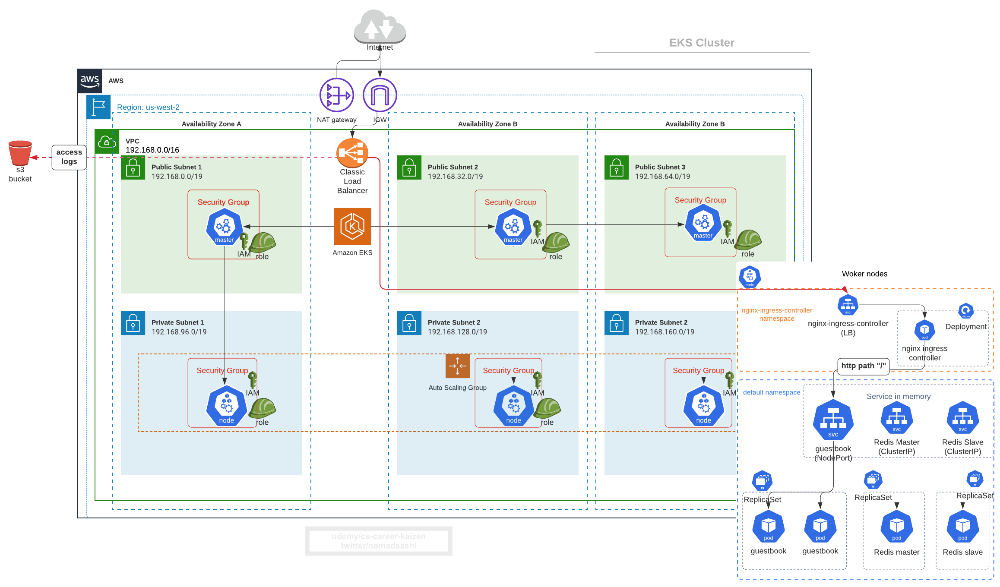

# 11. (BEST PRACTICE) Scaling (nodes): Cluster Autoscaler (CA) 

Ref: https://docs.aws.amazon.com/eks/latest/userguide/cluster-autoscaler.html




Cluster Autoscaler (CA) automatically adjusts the size of a Kubernetes Cluster so that all pods have a place to run and there are no unneeded nodes.

You need to configure three things:
1. set AWS ASG tags
2. set right IAM permission for cluster autoscaler by IRSA (per pod role) or by instance profile (WARNING: the [terraform aws module's IAM policy with string condition](https://github.com/terraform-aws-modules/terraform-aws-eks/blob/master/docs/autoscaling.md) __WILL NOT__ work for unmanaged node group, which prevents CA from setting desired capacity due to permission issue toward ASG resource)
3. create cluster-autoscaler resources in EKS cluster


# setup 1: Add tags to ASG

For k8s cluster-autoscaler to auto-discover ASGs with nodes, you need to tag worker group by 
```
k8s.io/cluster-autoscaler/enabled = true
```
and
```
k8s.io/cluster-autoscaler/<YOUR CLUSTER NAME> = owned
```

However, [AWS EKS Managed Node Groups](https://docs.aws.amazon.com/eks/latest/userguide/managed-node-groups.html) automatically adds these tags already:
> Nodes launched as part of a managed node group are __automatically tagged for auto-discovery__ by the Kubernetes cluster autoscaler and you can use the node group to apply Kubernetes labels to nodes and update them at any time.

> Amazon EKS tags managed node group resources so that they are configured to use the Kubernetes Cluster Autoscaler.


# (BEST PRACTICE) setup 2: Add IAM permissions to CA pod via either node's instance profile or IRSA

CA needs these permissions
```json
{
    "Version": "2012-10-17",
    "Statement": [
        {
            "Action": [
                "autoscaling:DescribeAutoScalingGroups",
                "autoscaling:DescribeAutoScalingInstances",
                "autoscaling:DescribeLaunchConfigurations",
                "autoscaling:DescribeTags",
                "autoscaling:SetDesiredCapacity",
                "autoscaling:TerminateInstanceInAutoScalingGroup",
                "ec2:DescribeLaunchTemplateVersions"
            ],
            "Resource": "*",
            "Effect": "Allow"
        }
    ]
}
```

Create `EKSFromEksctlClusterAutoscaler` IAM policy from IAM Console, and copy the IAM policy arn `arn:aws:iam::xxxxxxx:policy/EKSFromEksctlClusterAutoscaler`


Create Service account `cluster-autoscaler-aws-cluster-autoscaler` in `kube-system` namespace and IAM role, because these are needed for pod-level AWS permissions using IRSA.
```bash
eksctl create iamserviceaccount \
                --name cluster-autoscaler-aws-cluster-autoscaler \
                --namespace kube-system \
                --cluster eks-from-eksctl \
                --attach-policy-arn arn:aws:iam::202536423779:policy/EKSFromEksctlClusterAutoscaler \
                --approve \
                --region us-west-2

# output
[ℹ]  eksctl version 0.21.0
[ℹ]  using region us-west-2
[ℹ]  3 existing iamserviceaccount(s) (default/clusterautoscaler,default/irsa-service-account,kube-system/clusterautoscaler) will be excluded
[ℹ]  1 iamserviceaccount (kube-system/cluster-autoscaler-aws-cluster-autoscaler) was included (based on the include/exclude rules)
[ℹ]  combined exclude rules: default/clusterautoscaler,default/irsa-service-account,kube-system/clusterautoscaler
[ℹ]  no iamserviceaccounts present in the current set were excluded by the filter
[!]  serviceaccounts that exists in Kubernetes will be excluded, use --override-existing-serviceaccounts to override
[ℹ]  1 task: { 2 sequential sub-tasks: { create IAM role for serviceaccount "kube-system/cluster-autoscaler-aws-cluster-autoscaler", create serviceaccount "kube-system/cluster-autoscaler-aws-cluster-autoscaler" } }
[ℹ]  building iamserviceaccount stack "eksctl-eks-from-eksctl-addon-iamserviceaccount-kube-system-cluster-autoscaler-aws-cluster-autoscaler"
[ℹ]  deploying stack "eksctl-eks-from-eksctl-addon-iamserviceaccount-kube-system-cluster-autoscaler-aws-cluster-autoscaler"
```

Check IAM role created in IAM console:


# setup 3: Install CA by Helm chart
Ref: https://github.com/helm/charts/tree/master/stable/cluster-autoscaler

Modify [overrides.yaml](overrides.yaml) by adding `serviceAccountAnnotations` for IRSA and `clusterName`
```yaml
awsRegion: us-west-2

rbac:
  create: true # ref: https://github.com/kubernetes/autoscaler/issues/1507
  serviceAccount:
    create: false # because Service account and IAM role already created by `eksctl create iamserviceaccount` s

autoDiscovery:
  clusterName: eks-from-eksctl
  enabled: true
```

After checking yamls, install it with name `cluster-autoscaler` (which helm ends up creating `cluster-autoscaler-aws-cluster-autoscaler` service account by prepending `cluster-autoscaler-aws-` to it) and namespace `kube-system` (__IMPORTANT__: name and namespace need to match with service account  created in `kube-system` namespace)
```
helm install cluster-autoscaler \
    stable/cluster-autoscaler \
    --namespace kube-system \
    --values overrides.yaml
```

Output
```sh
NAME: cluster-autoscaler
LAST DEPLOYED: Mon Jun 15 00:01:00 2020
NAMESPACE: kube-system
STATUS: deployed
REVISION: 1
TEST SUITE: None
NOTES:
To verify that cluster-autoscaler has started, run:

  kubectl --namespace=kube-system get pods -l "app=aws-cluster-autoscaler,release=cluster-autoscaler"
```

Ensure the cluster-autoscaler pod is running:
```bash
$ kubectl --namespace=kube-system get pods | grep cluster-autoscaler

# output
NAME                                                        READY   STATUS    RESTARTS   AGE
cluster-autoscaler-aws-cluster-autoscaler-5545d4b97-9ztpm   1/1     Running   0          3m
```


# How to Test and Debug CA

Start a pod
```
kubectl apply -f test_irsa_ca.yaml

kubectl get pod test-irsa -n kube-system
kubectl exec -it pod test-irsa -n kube-system bash
```

Verify envs are injected
```
$ env | grep AWS
AWS_ROLE_ARN=arn:aws:iam::266981300450:role/eksctl-eks-from-eksctl-addon-iamserviceaccou-Role1-1KN3XZTA0TTJF
AWS_WEB_IDENTITY_TOKEN_FILE=/var/run/secrets/eks.amazonaws.com/serviceaccount/token
```
`AWS_WEB_IDENTITY_TOKEN_FILE` is owned by root but because of added `fsgroup` under `securityContext`, non-root user can read it
```
$ ls -ls /var/run/secrets/eks.amazonaws.com/serviceaccount/token
0 lrwxrwxrwx 1 root root 12 Apr 29 18:42 /var/run/secrets/eks.amazonaws.com/serviceaccount/token -> ..data/token

$ whoami
nobody

$ id
uid=99(nobody) gid=99(nobody) groups=99(nobody),2000

$ cat /var/run/secrets/eks.amazonaws.com/serviceaccount/token
```

Verify a pod has permissions for ASG
```
$ aws autoscaling describe-auto-scaling-instances --region us-east-1
```

Output
```
{
    "AutoScalingInstances": [
        {
            "InstanceId": "i-05b5c07094b1732af",
            "InstanceType": "m3.large",
            "AutoScalingGroupName": "eks-ue2-eks-demo-120200507173038542300000005",
            "AvailabilityZone": "us-east-1b",
            "LifecycleState": "InService",
            "HealthStatus": "HEALTHY",
            "LaunchConfigurationName": "eks-ue2-eks-demo-120200507173032181200000003",
            "ProtectedFromScaleIn": false
        },
        {
            "InstanceId": "i-0ea21df8315c87976",
            "InstanceType": "m3.large",
            "AutoScalingGroupName": "eks-ue2-eks-demo-120200507173038542900000006",
            "AvailabilityZone": "us-east-1b",
            "LifecycleState": "InService",
            "HealthStatus": "HEALTHY",
            "LaunchConfigurationName": 
```

Test another ASG permission for autoscaling
```
aws autoscaling set-desired-capacity \
    --auto-scaling-group-name eks-38b956c7-0ec3-a597-f1b3-d12e58aee6de \
    --desired-capacity 3 \
    --region us-west-2
```


Deploy nginx pod which has resource requests
```yaml
        resources:
          limits:
            cpu: 2500m
            memory: 2500Mi
          requests:
            cpu: 1400m # make this pod consume a lot of CPU resource on node
            memory: 1400Mi
```

__WARNING__: if CPU/memory request is bigger than a node's CPU/Memory capacity, you will get 
```
'NotTriggerScaleUp' pod didn't trigger scale-up (it wouldn't fit if a new node is added
``` 


Deploy resource intensive pod
```
kubectl apply -f test_scaling.yaml
```

Check deployment and pod
```
kubectl get deploy
kubectl get pod -o wide
```

Check worker node's resourse usage
```
kubectl top nodes
```

Output
```
NAME                                           CPU(cores)   CPU%   MEMORY(bytes)   MEMORY%   
ip-192-168-20-213.us-west-2.compute.internal   307m         15%    630Mi           18%   
```

Scale nginx deployment to 10 
```
kubectl scale --replicas=10 deployment/test-scaling
```

Check status of pod
```
kubectl get pod -w
NAME                                READY   STATUS    RESTARTS   AGE
test_scaling-98ffcf4f7-2skcx   0/1     Pending   0          42s
test_scaling-98ffcf4f7-5wsgn   0/1     Pending   0          42s
test_scaling-98ffcf4f7-99gmv   0/1     Pending   0          42s
test_scaling-98ffcf4f7-hw57s   0/1     Pending   0          42s
test_scaling-98ffcf4f7-lmq6l   0/1     Pending   0          42s
test_scaling-98ffcf4f7-n5hss   1/1     Running   0          42s
test_scaling-98ffcf4f7-rp9ng   1/1     Running   0          5m11s
test_scaling-98ffcf4f7-rzdtj   1/1     Running   0          42s
test_scaling-98ffcf4f7-scpb8   0/1     Pending   0          42s
test_scaling-98ffcf4f7-wt2vf   0/1     Pending   0          42s
```

Check events of pending pod
```
kubectl describe pod test_scaling-5b9dfddc87-ttnrt
```

Output should show `pod triggered scale-up`
```
  Type     Reason            Age                From                Message
  ----     ------            ----               ----                -------
  Warning  FailedScheduling  25s (x2 over 25s)  default-scheduler   0/2 nodes are available: 2 Insufficient cpu.
  Normal   TriggeredScaleUp  24s                cluster-autoscaler  pod triggered scale-up: [{eks-38b956c7-0ec3-a597-f1b3-d12e58aee6de 2->4 (max: 4)}]
```

You see 
```
0/2 nodes are available: 2 Insufficient cpu.
```

And
```
 cluster-autoscaler  pod triggered scale-up: [{eks-38b956c7-0ec3-a597-f1b3-d12e58aee6de 2->4 (max: 4)}]
```

View clusterautoscaler logs
```
kubectl logs cluster-autoscaler-aws-cluster-autoscaler-67bb6f64f5-cpw7h -n kube-system
```

Output should show you that staging node group should be able to scale up up to the max size limit as in `1 max node group size reached`
```
I0507 18:12:18.872668       1 scale_up.go:348] Skipping node group eks-ue2-eks-demo-120200507173038542300000005 - max size reached

I0507 18:12:18.873470       1 static_autoscaler.go:439] Scale down status: unneededOnly=true lastScaleUpTime=2020-05-07 18:10:18.182849499 +0000 UTC m=+2290.588530135 lastScaleDownDeleteTime=2020-05-07 17:32:28.323356185 +0000 UTC m=+20.729036698 lastScaleDownFailTime=2020-05-07 17:32:28.323357798 +0000 UTC m=+20.729038331 scaleDownForbidden=false isDeleteInProgress=false scaleDownInCooldown=true
I0507 18:12:18.873897       1 event.go:281] Event(v1.ObjectReference{Kind:"Pod", Namespace:"test", Name:"test_scaling-7499fc797-r8dsz", UID:"7bf9bd56-2f73-417e-9949-7722b0df5772", APIVersion:"v1", ResourceVersion:"270633", FieldPath:""}): type: 'Normal' reason: 'NotTriggerScaleUp' pod didn't trigger scale-up (it wouldn't fit if a new node is added): 1 node(s) didn't match node selector, 1 max node group size reached
```


# Limitations with eksctl Managed Node Group

There are __some downsides__ to managed node groups ([eksctl doc](https://eksctl.io/usage/eks-managed-nodes/#feature-parity-with-unmanaged-nodegroups)):
> Control over the node bootstrapping process and customization of the kubelet are not supported. This includes the following fields: classicLoadBalancerNames, maxPodsPerNode, __taints__, targetGroupARNs, preBootstrapCommands, __overrideBootstrapCommand__, clusterDNS and __kubeletExtraConfig__.

Hence, there are open Git requests [[EKS] [request]: Managed Node Groups Custom Userdata support #596](https://github.com/aws/containers-roadmap/issues/596) and [[EKS] Managed Node Groups Launch Template Support #585](https://github.com/aws/containers-roadmap/issues/585) to support:
- taint nodes in the managed worker node autoscaling group
- support custom userdata to "Restricting Access to Amazon EC2 Instance Profile Credentials"


# Clean up

```
kubectl delete -f test_irsa_ca.yaml
kubectl delete -f test_scaling.yaml
```