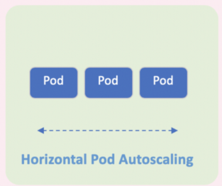

## 12. (BEST PRACTICE) Scaling (pods): Horizontal Pod Autoscaler (HPA)



# setup 1: Install metrics server in K8s cluster using Helm chart
Before deploying HPA, metrics server should be deployed, and you should be able to get metrics by
```
kubectl top nodes
kubectl top pods
```


# setup 2: Add k8s resourse requests in pod yaml

Also, a pod should have resource request and limit and metrics server can poll metrics.

So you shouldn't see something like below `unable to fetch pod metrics for pod default/eks-demo-74954f798-cnnvb: no metrics known for pod`
```
$ kubectl logs metrics-server-5fb44bc684-8xdjq -n kube-system
I0519 10:04:00.168107       1 serving.go:312] Generated self-signed cert (/tmp/apiserver.crt, /tmp/apiserver.key)
I0519 10:04:00.844946       1 secure_serving.go:116] Serving securely on [::]:8443
E0519 10:04:40.993273       1 reststorage.go:160] unable to fetch pod metrics for pod default/eks-demo-74954f798-cnnvb: no metrics known for pod
E0519 10:04:56.005862       1 reststorage.go:160] unable to fetch pod metrics for pod default/eks-demo-74954f798-cnnvb: no metrics known for pod
```


# Create Horizontal Pod Autoscaler

Create deployment
```
kubectl apply -f test-hpa.yaml
```

Create service
```
kubectl expose deploy test-hpa --port 80 --dry-run -o yaml > svc.yaml

kubectl apply -f svc.yaml
```

Test connecting to `test-hpa` nginx service from curl pod
```sh
kubectl run curl --image curlimages/curl -it sh

curl test-hpa

# output
<h1>Welcome to nginx!</h1>
```

Create HPA object
```
$ kubectl autoscale deployment test-hpa \
    --min 1 \
    --max 7 \
    --cpu-percent=80 \
    --namespace default \
    --dry-run \
    -o yaml > hpa.yaml

$ kubectl apply -f hpa.yaml
$ kubectl get hpa 
```

Output
```
NAME       REFERENCE             TARGETS         MINPODS   MAXPODS   REPLICAS   AGE
test-hpa   Deployment/test-hpa   <unknown>/80%   1         7         0          4s
```

__Wait for a few minutes until TARGETS show percentages__

`TARGETS` column should have two metrics `0%/50%`, the left is current usage and the right is the threshold wherein autoscaling will kick in.


# Stress Test HPA 
The following command uses the Apache Bench program to send hundreds of thousands of requests to the service. This should significantly increase the load and cause the autoscaler to scale out the deployment of pods, and eventually autoscale nodes as well.
```
kubectl run apache-bench -it --rm \
  --image=httpd \
  --restart Never \
  -- ab -n 500000000 -c 1000 test-hpa/


kubectl run -it --rm load-generator  \
  --restart Never \
  --image=busybox /bin/sh

while true; do wget -q -O- test-hpa:80; done
```

Check HPA stats and see it scaling
```bash
kubectl get hpa

# output 
NAME       REFERENCE             TARGETS   MINPODS   MAXPODS   REPLICAS   AGE
test-hpa   Deployment/test-hpa   96%/80%   1         7         2          9m19s
```

Check pod's resource
```
kubectl top pods
```


Clean up
```
kubectl delete -f test-hpa.yaml
kubectl delete svc test-hpa
kubectl delete deploy curl
```