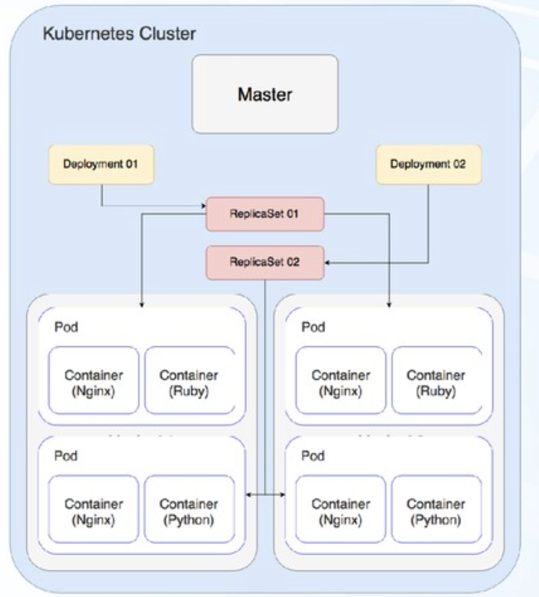

# 1. K8s Basics

# 1.1 Master Worker Architecture

Master node (i.e. AWS EKS calls this wrapper resource as Control Plane): 
- Brain of K8s cluster
- does heavy lifting of HA, security, storage, scaling, etc

Worker node: 
- Listens to master node and create/delete container workloads
- reports metrics to master node
- has container runtime

# 1.2 Master Node (Control Plane)

- API server: interacts with kubectl CLI
- Etcd: key-value store, implements locks
- Controller: health check, makes sure pods are running
- Scheduler: creates new pods and assign them to nodes

# 1.3 Worker Nodes (Data Plane)

- Kubelet: agent running on cluster nodes
- Container runtime: such as Docker runtime
- Kubectl: CLI to manage/deploy apps on cluster

# 1.4 K8s Objects - pod, deployment, service, configmap, serviceaccount, ingress, etc

Pod

Deployment

Service

Ingress

ConfigMap
