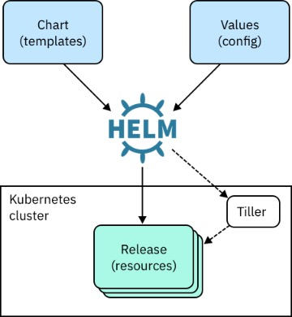

# 3. Helm Chart Quick Intro

## Install Helm v3 (tiller is deprecated)
Ref: https://helm.sh/docs/intro/install/
```bash
brew install helm

# Windows
choco install kubernetes-helm

helm version
```

## Helm Overview


- __externalize values__ in k8s resources (pod, deployment, service) into `values.yaml`
- package __multiple k8s resource files__ into a single wrapper object called helm chart
- chart contains all the application specific K8s resources such as deployment, service, ingress, horizontalPodAutoscaler, service account, hence __helm chart becomes a single deployable artifact__ instead of bunch of yaml files

## Helm Chart Anatomy
```bash
$ tree

.
├── Chart.yaml
├── charts
├── templates
│   ├── NOTES.txt
│   ├── _helpers.tpl
│   ├── deployment.yaml
│   ├── hpa.yaml
│   ├── ingress.yaml
│   ├── service.yaml
│   ├── serviceaccount.yaml
│   └── tests
│       └── test-connection.yaml
└── values.yaml
```

Top-level `Chart.yaml` contains its chart's metadata
```yaml
apiVersion: v2

# Helm Chart name
name: my-nginx
description: A Helm chart for Kubernetes

type: application

# Helm Chart version
version: 0.1.0

# Nginx version
appVersion: 1.16.0
```

Top-level `values.yaml` defines custom values to inject to k8s yamls
```yaml
replicaCount: 1

image:
  repository: nginx
  pullPolicy: IfNotPresent
  # Overrides the image tag whose default is the chart appVersion.
  tag: ""

service:
  type: ClusterIP
  port: 80

ingress:
  enabled: false
  annotations: {}
    # kubernetes.io/ingress.class: nginx
    # kubernetes.io/tls-acme: "true"
  hosts:
    - host: chart-example.local
      paths: []
  tls: []
  #  - secretName: chart-example-tls
  #    hosts:
  #      - chart-example.local

autoscaling:
  enabled: false
  minReplicas: 1
  maxReplicas: 100
  targetCPUUtilizationPercentage: 80
  # targetMemoryUtilizationPercentage: 80
```

`/templates` contains K8s resource yamls with templated syntax
```
├── templates
│   ├── NOTES.txt
│   ├── _helpers.tpl
│   ├── deployment.yaml
│   ├── hpa.yaml
│   ├── ingress.yaml
│   ├── service.yaml
│   ├── serviceaccount.yaml
```

## Helm Commands
Add some of popular Helm repo
```bash
helm repo add stable https://kubernetes-charts.storage.googleapis.com/
```

Search charts in repo
```bash
helm search repo stable

# this is nginx for ingress controller
helm search repo nginx

# for standalone nginx, add bitnami repo
helm repo add bitnami https://charts.bitnami.com/bitnami
helm repo update

#　search again
helm search repo nginx

# now bitnami/nginx shows up
helm search repo bitnami/nginx
```

Install
```bash
# USAGE: helm install RELEASE_NAME REPO_NAME
helm install nginx bitnami/nginx
```

Upgdate
```bash
# upgrade after changing values in yaml
helm upgrade nginx bitnami/nginx --dry-run

# upgrade using values in overrides.yaml
helm upgrade nignx bitnami/nginx -f overrides.yaml

# rollback
helm rollback nginx REVISION_NUMBER
```

Other commands
```bash
helm list 
helm status nginx
helm history nginx

# get manifest and values from deployment
helm get manifest nginx
helm get values nginx

helm uninstall nginx
```