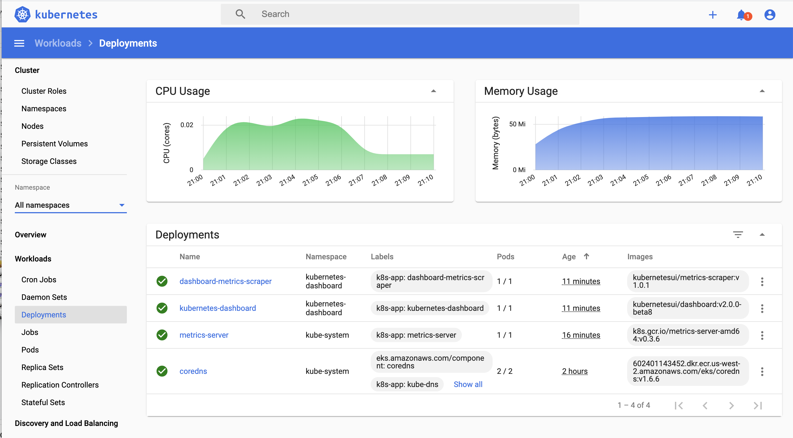
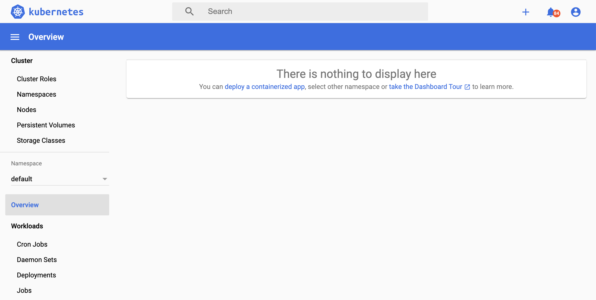

# 4. Deploy Kuberenetes Dashboard


# 4.1 Required setup 1: Install Metrics Server first so Dashboard can poll metrics
```
kubectl apply -f https://github.com/kubernetes-sigs/metrics-server/releases/download/v0.3.6/components.yaml
```

Check metrics-server deployment
```bash
kubectl get deployment metrics-server -n kube-system
```

Output
```bash
NAME             READY   UP-TO-DATE   AVAILABLE   AGE
metrics-server   1/1     1            1           82s
```

# 4.2 Required setup 2: Install Dashboard v2.0.0
Refs: 
- https://kubernetes.github.io/dashboard/
- https://docs.aws.amazon.com/eks/latest/userguide/dashboard-tutorial.html

```
kubectl apply -f https://raw.githubusercontent.com/kubernetes/dashboard/v2.0.0-beta8/aio/deploy/recommended.yaml
```

Output shows resources created in `kubernetes-dashboard` namespace
```bash
namespace/kubernetes-dashboard created
serviceaccount/kubernetes-dashboard created
service/kubernetes-dashboard created
secret/kubernetes-dashboard-certs created
secret/kubernetes-dashboard-csrf created
secret/kubernetes-dashboard-key-holder created
configmap/kubernetes-dashboard-settings created
role.rbac.authorization.k8s.io/kubernetes-dashboard created
clusterrole.rbac.authorization.k8s.io/kubernetes-dashboard created
rolebinding.rbac.authorization.k8s.io/kubernetes-dashboard created
clusterrolebinding.rbac.authorization.k8s.io/kubernetes-dashboard created
deployment.apps/kubernetes-dashboard created
service/dashboard-metrics-scraper created
deployment.apps/dashboard-metrics-scraper created
```

Get token (kinda like password) for dashboard
```
kubectl describe secret $(k get secret -n kubernetes-dashboard | grep kubernetes-dashboard-token | awk '{ print $1 }') -n kubernetes-dashboard
```

Create a secure channel from local to API server in Kubernetes cluster
```
kubectl proxy

# access this url from browser
http://localhost:8001/api/v1/namespaces/kubernetes-dashboard/services/https:kubernetes-dashboard:/proxy/
```



This is because the default service account `serviceaccount/kubernetes-dashboard` doesn't have much permission to view resources.

# 4.3 Required setup 3: Create RBAC to control what metrics can be visible

[eks-admin-service-account.yaml](eks-admin-service-account.yaml)
```
apiVersion: v1
kind: ServiceAccount
metadata:
  name: eks-admin
  namespace: kube-system
---
apiVersion: rbac.authorization.k8s.io/v1beta1
kind: ClusterRoleBinding
metadata:
  name: eks-admin
roleRef:
  apiGroup: rbac.authorization.k8s.io
  kind: ClusterRole
  name: cluster-admin # this is the cluster admin role
subjects:
- kind: ServiceAccount
  name: eks-admin
  namespace: kube-system
```

Apply
```
kubectl apply -f eks-admin-service-account.yaml
```

Check it created in `kube-system` namespace
```
kubectl get serviceaccount -n kube-system | grep eks-admin
eks-admin                            1         52s
```

Get a token from the `eks-admin` serviceaccount
```
kubectl -n kube-system describe secret $(kubectl -n kube-system get secret | grep eks-admin | awk '{print $1}')
```

Create a secure channel from local to API server in Kubernetes cluster
```
kubectl proxy

# access this url from browser
http://localhost:8001/api/v1/namespaces/kubernetes-dashboard/services/https:kubernetes-dashboard:/proxy/
```

Now dashboard shows full metrics in all namespaces


# 4.4 K8s Dashboard Walkthrough


## Uninstall Dashboard
```
kubectl delete -f https://raw.githubusercontent.com/kubernetes/dashboard/v2.0.0-beta8/aio/deploy/recommended.yaml

kubectl delete -f eks-admin-service-account.yaml
```