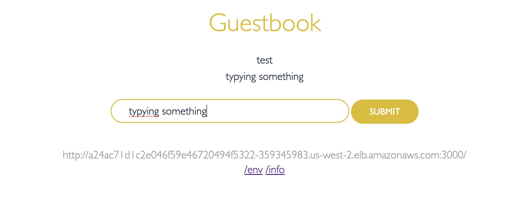
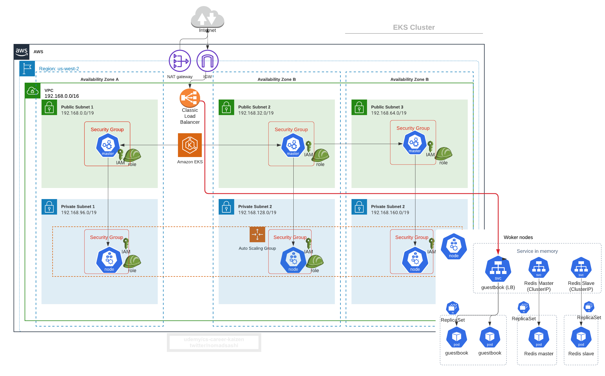

# 5. Deploy Sample App to EKS

Refs: 
- https://github.com/kubernetes/examples/blob/master/guestbook-go/README.md


Frontend PHP app
- load balanced by public ELB
- read request load balanced to multiple slaves
- write request to a single master

Backend Redis
- single master (write)
- multi slaves (read)
- slaves sync continuously from master

# 5.1 Deploy Redis Master
```
kubectl apply -f https://raw.githubusercontent.com/kubernetes/examples/master/guestbook-go/redis-master-controller.json

kubectl apply -f https://raw.githubusercontent.com/kubernetes/examples/master/guestbook-go/redis-master-service.json
```

# 5.2 Deploy Redis Slave
```
kubectl apply -f https://raw.githubusercontent.com/kubernetes/examples/master/guestbook-go/redis-slave-controller.json

kubectl apply -f https://raw.githubusercontent.com/kubernetes/examples/master/guestbook-go/redis-slave-service.json
```

# 5.3 Deploy frontend app
```
kubectl apply -f https://raw.githubusercontent.com/kubernetes/examples/master/guestbook-go/guestbook-controller.json

kubectl apply -f https://raw.githubusercontent.com/kubernetes/examples/master/guestbook-go/guestbook-service.json
```

Show `replicationcontroller` (which is deprecated k8s resource succeeded by `replicaset` now)created
```
kubectl get replicationcontroller
```

Output
```
NAME           DESIRED   CURRENT   READY   AGE
guestbook      3         3         3       15m
redis-master   1         1         1       16m
redis-slave    2         2         2       15m
```

Get service and pod
```
kubectl get pod,service
```

Output
```
NAME                     READY   STATUS    RESTARTS   AGE
pod/guestbook-dxkpd      1/1     Running   0          16m
pod/guestbook-fsqx8      1/1     Running   0          16m
pod/guestbook-nnrjc      1/1     Running   0          16m
pod/redis-master-6dbj4   1/1     Running   0          17m
pod/redis-slave-c6wtv    1/1     Running   0          16m
pod/redis-slave-qccp6    1/1     Running   0          16m

NAME                   TYPE           CLUSTER-IP      EXTERN
AL-IP
       PORT(S)          AGE
service/guestbook      LoadBalancer   10.100.36.45    a24ac7
1d1c2e046f59e46720494f5322-359345983.us-west-2.elb.amazonaws
.com   3000:30604/TCP   15m
service/kubernetes     ClusterIP      10.100.0.1      <none>

       443/TCP          158m
service/redis-master   ClusterIP      10.100.174.46   <none>

       6379/TCP         17m
service/redis-slave    ClusterIP      10.100.103.40   <none>

       6379/TCP         16m
```

# 5.4 Get external ELB DNS
```
$ echo $(kubectl  get svc guestbook | awk '{ print $4 }' | tail -1):$(kubectl  get svc guestbook | awk '{ print $5 }' | tail -1 | cut -d ":" -f 1
3000)

a24ac71d1c2e046f59e46720494f5322-359345983.us-west-2.elb.amazonaws.com:3000
```

Visit it from browser __after 3-5 minutes when ELB is ready__




# 5.5 What Just Happened?!



#### How to Uninstall all the resources (don't do it yet, as we will expose these pods with Ingress in the next chapter)
```
kubectl delete -f examples/guestbook-go
```