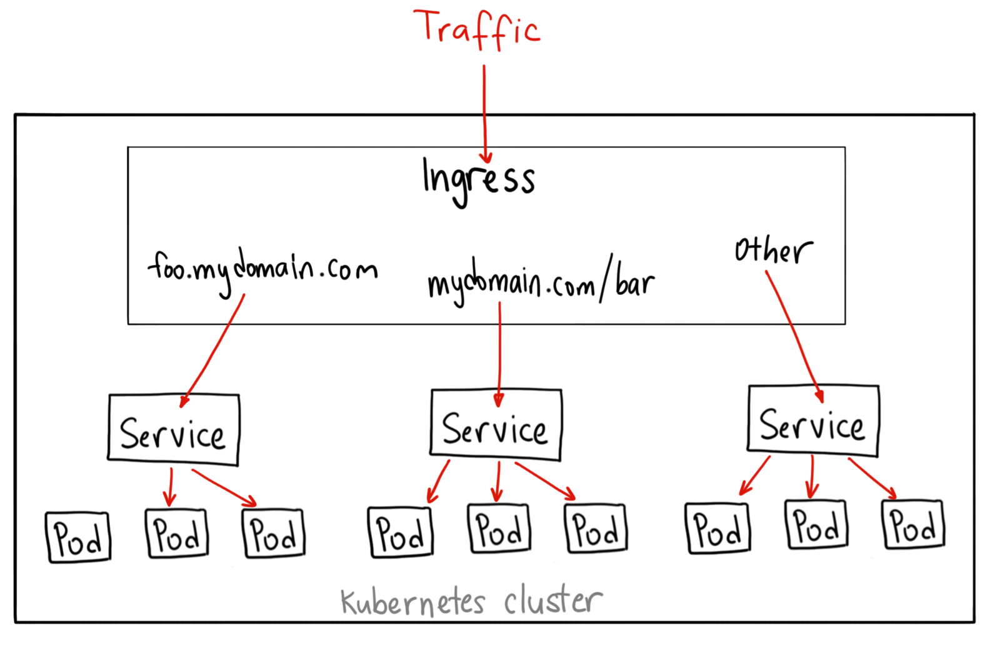
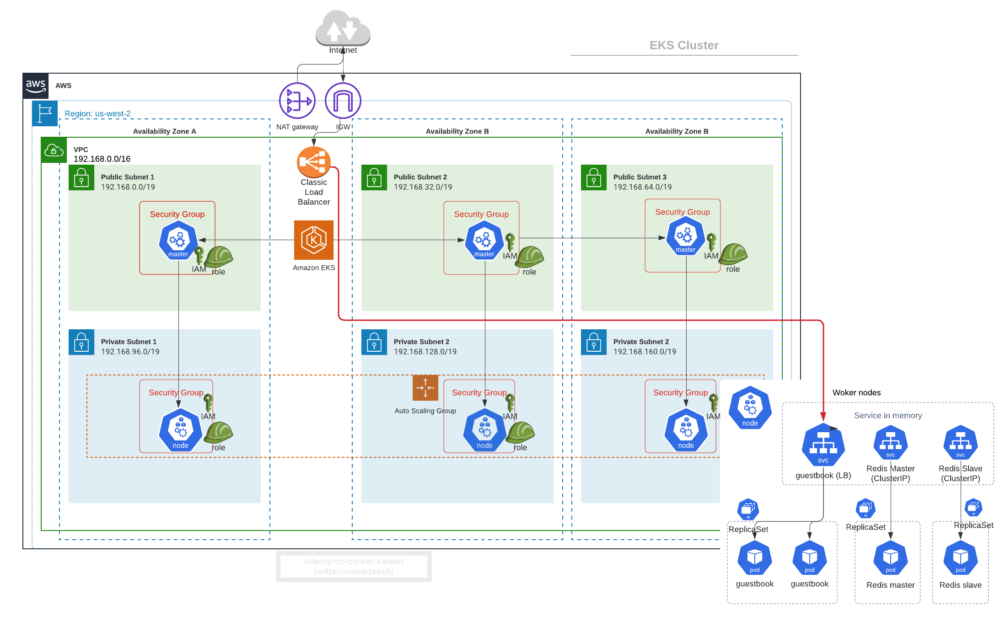

# 6. Networking: Expose pods using Ingress Controller (which creates AWS ELB)

__NOTE__:
Even if this course touts __Zero to Hero AWS EKS Handson Production Best Practices 2020__, for illustration purpose, we'll use __nginx ingress controller__ to set up AWS ELB. In production, you would be using __istio gateway__, __traefik__, etc, but that'd require another course.


Previously, we saw `guestbook` service was exposed as of type `LoadBalancer`.

Get `guestbook` service 
```
kubectl get service guestbook
```

Output
```
NAME        TYPE           CLUSTER-IP     EXTERNAL-IP                                                              PORT(S)          AGE
guestbook   LoadBalancer   10.100.36.45   a24ac71d1c2e046f59e46720494f5322-359345983.us-west-2.elb.amazonaws.com   3000:30604/TCP   39m
```

There are a few __downsides__ of service of type `LoadBalancer`:
- is L4 load balancer, therefore has no knowledge about L7 (i.e. http path and host).
- is costly as each new service creates a new load balancer (one to one mapping between service and load balancer)


Enters `INGRESS` K8s resource


# 6.1 Create Ingress Controller (Nginx) using Helm Chart
Refs: 
- https://github.com/helm/charts/tree/master/stable/nginx-ingress
- https://kubernetes.github.io/ingress-nginx/deploy/
- https://github.com/kubernetes/ingress-nginx/tree/master/charts/ingress-nginx

```sh
kubectl create namespace nginx-ingress-controller

# stable/nginx-ingress is deprecated 
# helm install nginx-ingress-controller stable/nginx-ingress -n nginx-ingress-controller

# add new repo ingress-nginx/ingress-nginx
helm repo add ingress-nginx https://kubernetes.github.io/ingress-nginx
helm repo add stable https://charts.helm.sh/stable
helm repo update

# install
helm install nginx-ingress-controller ingress-nginx/ingress-nginx
```

Output
```bash
NAME: nginx-ingress-controller
LAST DEPLOYED: Sat Jun 13 22:13:54 2020
NAMESPACE: nginx-ingress-controller
STATUS: deployed
REVISION: 1
TEST SUITE: None
NOTES:
The nginx-ingress controller has been installed.
It may take a few minutes for the LoadBalancer IP to be available.
You can watch the status by running 'kubectl --namespace nginx-ingress-controller get services -o wide -w nginx-ingress-controller-controller'

An example Ingress that makes use of the controller:

  apiVersion: extensions/v1beta1
  kind: Ingress
  metadata:
    annotations:
      kubernetes.io/ingress.class: nginx
    name: example
    namespace: foo
  spec:
    rules:
      - host: www.example.com
        http:
          paths:
            - backend:
                serviceName: exampleService
                servicePort: 80
              path: /
    # This section is only required if TLS is to be enabled for the Ingress
    tls:
        - hosts:
            - www.example.com
          secretName: example-tls

If TLS is enabled for the Ingress, a Secret containing the certificate and key must also be provided:

  apiVersion: v1
  kind: Secret
  metadata:
    name: example-tls
    namespace: foo
  data:
    tls.crt: <base64 encoded cert>
    tls.key: <base64 encoded key>
  type: kubernetes.io/tls
```

Check pods, services, and deployments created in `nginx-ingress-controller` namespace
```
kubectl get pod,svc,deploy -n nginx-ingress-controller
```

Outout
```bash
NAME                                                            READY   STATUS    RESTARTS   AGE
pod/nginx-ingress-controller-controller-767d5fd45d-pv7ck        1/1     Running   0          2m28s
pod/nginx-ingress-controller-default-backend-7db948667c-bktm9   1/1     Running   0          2m28s

NAME                                               TYPE           CLUSTER-IP      EXTERNAL-IP                                                               PORT(S)                      AGE
service/nginx-ingress-controller-controller        LoadBalancer   10.100.66.170   a588cbec4e4e34e1bbc1cc066f38e3e0-1988798789.us-west-2.elb.amazonaws.com   80:31381/TCP,443:30019/TCP   2m29s
service/nginx-ingress-controller-default-backend   ClusterIP      10.100.213.5    <none>                                                                    80/TCP                       2m29s

NAME                                       READY   UP-TO-DATE   AVAILABLE   AGE
nginx-ingress-controller-controller        1/1     1            1           32m
nginx-ingress-controller-default-backend   1/1     1            1           32m
```

You see `nginx-ingress-controller-controller` service of type `LoadBalancer`. This is still L4 load balancer but `nginx-ingress-controller-controller` pod is running nginx inside to do L7 load balancing inside EKS cluster.


# 6.2 Create Ingress resource for L7 load balancing by http hosts & paths

[ingress.yaml](ingress.yaml)
```yaml
apiVersion: extensions/v1beta1
  kind: Ingress
  metadata:
    annotations:
      kubernetes.io/ingress.class: nginx
    name: guestbook
    namespace: default
  spec:
    rules:
      - http:
          paths:
            - backend:
                serviceName: guestbook
                servicePort: 3000 
              path: /
```

Create ingress resource
```bash
kubectl apply -f ingress.yaml
```

Get the public DNS of AWS ELB created from the `nginx-ingress-controller-controller` service
```bash
kubectl  get svc nginx-ingress-controller-controller -n nginx-ingress-controller | awk '{ print $4 }' | tail -1
```

Output
```bash
# visit this from browser
a588cbec4e4e34e1bbc1cc066f38e3e0-1988798789.us-west-2.elb.amazonaws.com
```


Now modify `guestbook` service type from `LoadBalancer` to `NodePort`.

First get yaml 
```bash
kubectl get svc guestbook -o yaml
```

Output
```yaml
apiVersion: v1
kind: Service
metadata:
  annotations:
    kubectl.kubernetes.io/last-applied-configuration: |
      {"apiVersion":"v1","kind":"Service","metadata":{"annotations":{},"labels":{"app":"guestbook"},"name":"guestbook","namespace":"default"},"spec":{"ports":[{"port":3000,"targetPort":"http-server"}],"selector":{"app":"guestbook"},"type":"LoadBalancer"}}
  creationTimestamp: "2020-06-13T14:20:12Z"
  finalizers:
  - service.kubernetes.io/load-balancer-cleanup
  labels:
    app: guestbook
  name: guestbook
  namespace: default
  resourceVersion: "14757"
  selfLink: /api/v1/namespaces/default/services/guestbook
  uid: 24ac71d1-c2e0-46f5-9e46-720494f5322b
spec:
  clusterIP: 10.100.36.45
  externalTrafficPolicy: Cluster
  ports:
  - nodePort: 30604
    port: 3000
    protocol: TCP
    targetPort: http-server
  selector:
    app: guestbook
  sessionAffinity: None
  type: LoadBalancer
status:
  loadBalancer:
    ingress:
    - hostname: a24ac71d1c2e046f59e46720494f5322-359345983.us-west-2.elb.amazonaws.com
```

Strip out `status` etc that are added after created
[service_guestbook_nodeport.yaml](service_guestbook_nodeport.yaml)
```
apiVersion: v1
kind: Service
metadata:
  annotations:
  labels:
    app: guestbook
  name: guestbook
  namespace: default
spec:
  ports:
  - nodePort: 30605
    port: 3000
    protocol: TCP
    targetPort: http-server
  selector:
    app: guestbook
  type: NodePort
```

Delete the existing `guestbook` service as service is immutable
```bash
kubectl delete svc guestbook
```

Then apply new service
```bash
kubectl apply -f service_guestbook_nodeport.yaml
```

Check services in `default` namespace
```bash
$ kubectl get svc

NAME           TYPE        CLUSTER-IP      EXTERNAL-IP   PORT(S)          AGE
guestbook      NodePort    10.100.53.19    <none>        3000:30605/TCP   20s
kubernetes     ClusterIP   10.100.0.1      <none>        443/TCP          3h38m
redis-master   ClusterIP   10.100.174.46   <none>        6379/TCP         77m
redis-slave    ClusterIP   10.100.103.40   <none>        6379/TCP         76m
```

Lastly, check ingress controller's public DNS is reachable from browser
```bash
# visit the URL from browser
kubectl  get svc nginx-ingress-controller-controller -n nginx-ingress-controller | awk '{ print $4 }' | tail -1
```

# 6.3  What Just Happened?

1. Replaced `guestbook` service of type `LoadBalancer` to of `NodePort`
2. Front `guestbook` service with `nginx-ingress-controller` service of type `LoadBalancer`
3. `nginx-ingress-controller` pod will do L7 load balancing based on HTTP path and host
4. Now you can create multiple services and bind them to one ingress controller (one AWS ELB)

__Before Ingress__


__After Ingress__


# 6.4 (BEST PRACTICE) Enable HTTPS for AWS ELB (SSL Termination at ELB)
If you visit the public DNS of ELB with https, you will see a fake Nginx certificate


This is the default cert configured in `/etc/nginx/nginx.conf` inside `nginx-ingress-controller-controller` pod
```sh
# ssh into the pod
kubectl exec -it nginx-ingress-controller-controller-767d5fd45d-q7cpw -n nginx-ingress-controller sh

# grep for "ssl"
$ grep -r "ssl" *.conf

nginx.conf:                     is_ssl_passthrough_enabled = false,
nginx.conf:             listen_ports = { ssl_proxy = "442", https = "443" },
nginx.conf:     ssl_certificate     /etc/ingress-controller/ssl/default-fake-certificate.pem; # <-- here fake cert
nginx.conf:     ssl_certificate_key /etc/ingress-controller/ssl/default-fake-certificate.pem;
```

This is the case 2 [SSL terminates at Nginx Ingress Controller pod]


To achieve SSL termination at AWS ELB (case 1 in the diagram), you need to provision SSL cert and associate it with ELB.


## 1. Create Self-signed Server Certificate (1024 or 2048 bit long)

Refs: 
- https://kubernetes.github.io/ingress-nginx/user-guide/tls/#tls-secrets
- https://kubernetes.github.io/ingress-nginx/user-guide/tls/#tls-secretshttps://stackoverflow.com/questions/10175812/how-to-create-a-self-signed-certificate-with-openssl

Since we don't own any domains for this course, we need to create a self-signed cert by ourselves.

```bash
# -x509: this option outputs a self signed certificate instead of a certificate request. This is typically used to generate a test certificate or a self signed root CA.
# -newkey rsa:2048: this option creates a new certificate request and a new private key. The argument takes one of several forms. rsa:nbits, where nbits is the number of bits, generates an RSA key nbits in size.
# -keyout: this gives the filename to write the newly created private key to.
# -out: This specifies the output filename to write to or standard output by default.
# -days: when the -x509 option is being used this specifies the number of days to certify the certificate for. The default is 30 days.
# -nodes: if this option is specified then if a private key is created it will not be encrypted.
openssl req \
        -x509 \
        -newkey rsa:2048 \
        -keyout elb.amazonaws.com.key.pem \
        -out elb.amazonaws.com.cert.pem \
        -days 365 \
        -nodes \
        -subj '/CN=*.elb.amazonaws.com'
```

Check contents of cert
```sh
openssl x509 -in elb.amazonaws.com.cert.pem -text -noout
```

Output
```
Certificate:
    Data:
        Version: 1 (0x0)
        Serial Number: 15293043281836592574 (0xd43bcdd6bc8b4dbe)
    Signature Algorithm: sha256WithRSAEncryption
        Issuer: CN=*.elb.amazonaws.com
        Validity
            Not Before: Jun 14 09:10:37 2020 GMT
            Not After : Jun 14 09:10:37 2021 GMT
        Subject: CN=*.elb.amazonaws.com
        Subject Public Key Info:
            Public Key Algorithm: rsaEncryption
                Public-Key: (2048 bit)
```

## 2. Import Server Certificate to ACM (Amazon Certificate Manager)
Ref: https://docs.aws.amazon.com/acm/latest/userguide/import-certificate-api-cli.html

```bash
aws acm import-certificate \
  --certificate fileb://elb.amazonaws.com.cert.pem \
  --private-key fileb://elb.amazonaws.com.key.pem \
  --region us-west-2
```

Output shows certicate ARN (Amazon Resource Name)
```
{
    "CertificateArn": "arn:aws:acm:us-west-2:xxxxxx:certificate/d9237fc3-e8e5-4749-bbcd-4c68955ca645"
}
```

You can see the new cert in AWS ACM console.


## 3. Add AWS ACM ARN to Nginx ingress controller's service annotations in overrides.yaml
Refs:
- https://kubernetes.io/docs/concepts/services-networking/service/#ssl-support-on-aws
- https://github.com/helm/charts/tree/master/stable/nginx-ingress

Edit and replace `YOUR_CERT_ARN` with your cert ARN in [nginx_helm_chart_overrides_ssl_termination_at_elb.yaml](nginx_helm_chart_overrides_ssl_termination_at_elb.yaml)
```yaml
controller:
  service:
    annotations:
      # https for AWS ELB. Ref: https://kubernetes.io/docs/concepts/services-networking/service/#ssl-support-on-aws
      service.beta.kubernetes.io/aws-load-balancer-ssl-cert: "YOUR_CERT_ARN"
      service.beta.kubernetes.io/aws-load-balancer-backend-protocol: "tcp" # backend pod doesn't speak HTTPS
      service.beta.kubernetes.io/aws-load-balancer-ssl-ports: "443" # unless ports specified, even port 80 will be SSL provided
    targetPorts:
      https: http # TSL Terminates at the ELB
  config:
    ssl-redirect: "false" # don't let https to AWS ELB -> http to Nginx redirect to -> https to Nginx
```

## 4. Upgrade Nginx ingress controller Helm chart
```bash
helm upgrade nginx-ingress-controller \
    stable/nginx-ingress \
    -n nginx-ingress-controller \
    -f nginx_helm_chart_overrides_ssl_termination_at_elb.yaml
```

Check `nginx-ingress-controller-controller` service in `nginx-ingress-controller` namespace have annotation added
```sh
kubectl describe svc nginx-ingress-controller-controller -n nginx-ingress-controller
```

Output
```sh
Name:                     nginx-ingress-controller-controller
Namespace:                nginx-ingress-controller
Labels:                   app=nginx-ingress
                          app.kubernetes.io/managed-by=Helm
                          chart=nginx-ingress-1.39.1
                          component=controller
                          heritage=Helm
                          release=nginx-ingress-controller
Annotations:              meta.helm.sh/release-name: nginx-ingress-controller
                          meta.helm.sh/release-namespace: nginx-ingress-controller
                          service.beta.kubernetes.io/aws-load-balancer-ssl-cert: arn:aws:acm:us-west-2:202536423779:certificate/d9237fc3-e8e5-4749-bbcd-4c68955ca645  # <--- added here
```

Check AWS Console > EC2 > Load Balancer:


Visit the public DNS of ELB again from browser
```bash
# visit the URL from browser
kubectl  get svc nginx-ingress-controller-controller -n nginx-ingress-controller | awk '{ print $4 }' | tail -1

# output
aa77ffae4f03448f486e52cf66cf05ca-5780179.us-west-2.elb.amazonaws.com
```

## 5. How to Fix "400 Bad Request. The plain HTTP request was sent to HTTPS port"

Ref: Ref: https://github.com/kubernetes/ingress-nginx/issues/918#issuecomment-327849334


Same if you curl 
```bash
curl https://aa77ffae4f03448f486e52cf66cf05ca-5780179.us-west-2.elb.amazonaws.com/ -v -k

# output 
< HTTP/1.1 400 Bad Request
< Content-Type: text/html
< Date: Sun, 14 Jun 2020 09:47:49 GMT
< Server: nginx/1.17.10
< Content-Length: 256
< Connection: keep-alive
< 
<html>
<head><title>400 The plain HTTP request was sent to HTTPS port</title></head>
```

This is because by default, Nginx Ingress Controller's _service_ definition has `controller.service.targetPorts.https=443` or in yaml format (https://github.com/helm/charts/tree/master/stable/nginx-ingress),

```sh
service:
    targetPorts:
      http: 80
      https: 443  # <--- this means incoming HTTPs to ELB will be sent to backend (Nginx Ingress Controller) 443
```


Edit and replace `YOUR_CERT_ARN` with your cert ARN in [nginx_helm_chart_overrides_ssl_termination_at_elb_redirect_http.yaml](nginx_helm_chart_overrides_ssl_termination_at_elb_redirect_http.yaml)
```yaml
controller:
  service:
    annotations:
      # https for AWS ELB. Ref: https://kubernetes.io/docs/concepts/services-networking/service/#ssl-support-on-aws
      service.beta.kubernetes.io/aws-load-balancer-ssl-cert: "YOUR_CERT_ARN"
      service.beta.kubernetes.io/aws-load-balancer-backend-protocol: "http" # backend pod doesn't speak HTTPS
      service.beta.kubernetes.io/aws-load-balancer-ssl-ports: "443" # unless ports specified, even port 80 will be SSL provided
    targetPorts:
      https: http # TSL Terminates at the ELB
```

Upgrade Nginx helm chart with a new override yaml
```
helm upgrade nginx-ingress-controller \
            stable/nginx-ingress \
            -n nginx-ingress-controller \
            -f nginx_helm_chart_overrides_ssl_termination_at_elb_redirect_http.yaml
```

Check `nginx-ingress-controller-controller` service in `nginx-ingress-controller` namespace have annotation added
```sh
kubectl describe svc nginx-ingress-controller-controller -n nginx-ingress-controller
```

Output
```sh
Name:                     nginx-ingress-controller-controller
Namespace:                nginx-ingress-controller
Labels:                   app=nginx-ingress
                          app.kubernetes.io/managed-by=Helm
                          chart=nginx-ingress-1.39.1
                          component=controller
                          heritage=Helm
                          release=nginx-ingress-controller
Annotations:              meta.helm.sh/release-name: nginx-ingress-controller
                          meta.helm.sh/release-namespace: nginx-ingress-controller
                          service.beta.kubernetes.io/aws-load-balancer-ssl-cert: arn:aws:acm:us-west-2:202536423779:certificate/d9237fc3-e8e5-4749-bbcd-4c68955ca645  # <--- added here
```

Now you can access the public DNS of ELB and get HTTP 200 code, and also can see the self-signed cert.


# 6.5 Enable SSL Termination at Nginx Ingress Controller

Ref: https://kubernetes.io/docs/concepts/services-networking/ingress/#tls

Create a K8s secret based on the same self-signed cert
```
kubectl create secret tls tls-secret \
  --cert=elb.amazonaws.com.cert.pem \
  --key=elb.amazonaws.com.key.pem
```

Reference it from [ingress.yaml](ingress.yaml)
```sh
apiVersion: extensions/v1beta1
kind: Ingress
metadata:
  annotations:
    kubernetes.io/ingress.class: nginx
    # nginx.ingress.kubernetes.io/backend-protocol: "HTTPS" # this is the case where a container accept HTTPS
  name: guestbook
  namespace: default
spec:
  #  this is in case SSL termination happens at nginx ingress controller
  tls:
  - hosts:
    - "YOUR_ELB_DNS" # <-- currently ingress host doesn't allow wildcard
    secretName: tls-secret  # <--- specify secret containing cert
  rules:
    - http:
        paths:
          - backend:
              serviceName: guestbook
              servicePort: 3000 
            path: /
```

Apply it
```
kubectl apply -f ingress.yaml
```

Upgrade Nginx Helm Chart with [nginx_helm_chart_overrides_ssl_termination_at_nginx.yaml](nginx_helm_chart_overrides_ssl_termination_at_nginx.yaml)
```
helm upgrade nginx-ingress-controller \
    stable/nginx-ingress \
    -n nginx-ingress-controller \
    -f nginx_helm_chart_overrides_ssl_termination_at_nginx.yaml
```

Check `nginx-ingress-controller-controller` service in `nginx-ingress-controller` namespace have annotation added
```sh
kubectl describe svc nginx-ingress-controller-controller -n nginx-ingress-controller
```

Output
```sh
Name:                     nginx-ingress-controller-controller
Namespace:                nginx-ingress-controller
Labels:                   app=nginx-ingress
                          app.kubernetes.io/managed-by=Helm
                          chart=nginx-ingress-1.39.1
                          component=controller
                          heritage=Helm
                          release=nginx-ingress-controller
Annotations:              meta.helm.sh/release-name: nginx-ingress-controller
                          meta.helm.sh/release-namespace: nginx-ingress-controller # <--- SSL cert annotation is gone
Selector:                 app.kubernetes.io/component=controller,app=nginx-ingress,release=nginx-ingress-controller
```

Check curl response 
```
curl https://af54f0a1c6b544b6283a384c57b77ecb-950756925.us-west-2.elb.amazonaws.com/ -k -v
```


# 6.5 (BEST PRACTICE) Enable ELB access logs by K8s service annotations
Creating AWS ELB from K8s ingress controller isn't enough for production.

You need to enable access logs of ELB.

1. Create S3 bucket for ELB to send access logs to
```bash
# from S3 console, create this bucket
eks-from-eksctl-elb-access-log
```
2. Create S3 bucket policy so that ELB can push it to the bucket
Ref: https://docs.aws.amazon.com/elasticloadbalancing/latest/classic/enable-access-logs.html

Given this template [s3_bucket_policy_elb_access_log.json](s3_bucket_policy_elb_access_log.json),
you need to interpolate `elb-account-id` based on your region, `your-aws-account-id`, `bucket-name`, and `prefix`.
```json
{
  "Version": "2012-10-17",
  "Statement": [
    {
      "Effect": "Allow",
      "Principal": {
        "AWS": "arn:aws:iam::elb-account-id:root"
      },
      "Action": "s3:PutObject",
      "Resource": "arn:aws:s3:::bucket-name/prefix/AWSLogs/your-aws-account-id/*"
    },
    {
      "Effect": "Allow",
      "Principal": {
        "Service": "delivery.logs.amazonaws.com"
      },
      "Action": "s3:PutObject",
      "Resource": "arn:aws:s3:::bucket-name/prefix/AWSLogs/your-aws-account-id/*",
      "Condition": {
        "StringEquals": {
          "s3:x-amz-acl": "bucket-owner-full-control"
        }
      }
    },
    {
      "Effect": "Allow",
      "Principal": {
        "Service": "delivery.logs.amazonaws.com"
      },
      "Action": "s3:GetBucketAcl",
      "Resource": "arn:aws:s3:::bucket-name"
    }
  ]
}
```


```json
{
  "Version": "2012-10-17",
  "Statement": [
    {
      "Effect": "Allow",
      "Principal": {
        "AWS": "arn:aws:iam::797873946194:root"
      },
      "Action": "s3:PutObject",
      "Resource": "arn:aws:s3:::eks-from-eksctl-elb-access-log/public-elb/AWSLogs/202536423779:/*"
    },
    {
      "Effect": "Allow",
      "Principal": {
        "Service": "delivery.logs.amazonaws.com"
      },
      "Action": "s3:PutObject",
      "Resource": "arn:aws:s3:::eks-from-eksctl-elb-access-log/public-elb/AWSLogs/202536423779:/*",
      "Condition": {
        "StringEquals": {
          "s3:x-amz-acl": "bucket-owner-full-control"
        }
      }
    },
    {
      "Effect": "Allow",
      "Principal": {
        "Service": "delivery.logs.amazonaws.com"
      },
      "Action": "s3:GetBucketAcl",
      "Resource": "arn:aws:s3:::eks-from-eksctl-elb-access-log"
    }
  ]
}
```

3. Add k8s service annotations to `nginx-ingress-controller` service so it knows access log bucket
Ref: https://kubernetes.io/docs/concepts/services-networking/service/#elb-access-logs-on-aws

These annotations need to be added to `nginx-ingress-controller` service
```yaml
metadata:
      name: my-service
      annotations:
        service.beta.kubernetes.io/aws-load-balancer-access-log-enabled: "true"
        # Specifies whether access logs are enabled for the load balancer
        service.beta.kubernetes.io/aws-load-balancer-access-log-emit-interval: "60"
        # The interval for publishing the access logs. You can specify an interval of either 5 or 60 (minutes).
        service.beta.kubernetes.io/aws-load-balancer-access-log-s3-bucket-name: "my-bucket"
        # The name of the Amazon S3 bucket where the access logs are stored
        service.beta.kubernetes.io/aws-load-balancer-access-log-s3-bucket-prefix: "my-bucket-prefix/prod"
        # The logical hierarchy you created for your Amazon S3 bucket, for example `my-bucket-prefix/prod`
```

To add this, add above to `nginx_helm_chart_overrides_access_logs.yaml` which will be passed when installing `nginx` helm chart.

[nginx_helm_chart_overrides_access_logs.yaml](nginx_helm_chart_overrides_access_logs.yaml)
```yaml
controller:
  service:
    annotations:
      # https for AWS ELB. Ref: https://kubernetes.io/docs/concepts/services-networking/service/#ssl-support-on-aws
      service.beta.kubernetes.io/aws-load-balancer-ssl-cert: "YOUR_CERT_ARN"
      service.beta.kubernetes.io/aws-load-balancer-backend-protocol: "http" # backend pod doesn't speak HTTPS
      service.beta.kubernetes.io/aws-load-balancer-ssl-ports: "443" # unless ports specified, even port 80 will be SSL provided
      # access logs for AWS ELB
      service.beta.kubernetes.io/aws-load-balancer-access-log-enabled: "true"
      service.beta.kubernetes.io/aws-load-balancer-access-log-emit-interval: "60"  # The interval for publishing the access logs. You can specify an interval of either 5 or 60 (minutes).
      service.beta.kubernetes.io/aws-load-balancer-access-log-s3-bucket-name: "eks-from-eksctl-elb-access-log"
      service.beta.kubernetes.io/aws-load-balancer-access-log-s3-bucket-prefix: "public-elb"
    targetPorts:
      https: http # TSL Terminates at the ELB
```

4. Upgrade Nginx ingress controller specifying overriding yaml file with `-f` option (ideally in production, you would add service annotations before first install)

```sh
# upgrade it with -f nginx_helm_chart_overrides_access_logs.yaml
helm upgrade nginx-ingress-controller \
    stable/nginx-ingress \
    -n nginx-ingress-controller \
    -f nginx_helm_chart_overrides_access_logs.yaml
```


## What Just Happened with ELB Access Log?
__After Ingress__


# 6.6 Limitations with Nginx Ingress Controller

__NOTE__:
Even if this course touts __Zero to Hero AWS EKS Handson Production Best Practices 2020__, for illustration purpose, we'll use __nginx ingress controller__ to set up AWS ELB. In production, you would be using __istio gateway__, __traefik__, etc, but that'd require another course.

There are several documented pitalls with using Nginx ingress controllers such as:
- [Painless Nginx](https://danielfm.me/posts/painless-nginx-ingress.html)
    - [Tuning Nginx](https://www.nginx.com/blog/tuning-nginx/)
- [Kubernetes Ingress Controllers: How to choose the right one: Part 1](https://itnext.io/kubernetes-ingress-controllers-how-to-choose-the-right-one-part-1-41d3554978d2)


Some lessons are:
> Do not share Nginx Ingress for multiple environments

> Tuning Worker Process and Memory Settings

Basically, if you have multiple ingress resources in multiple namespaces, and if you are sharing Nginx ingress controller across namespaces, every time ingress resource changes, Nginx will need to reload a massive config file by merging all together into a file. This reloading could take some time, as the author points out

> Nginx config file got humongous and very slow to reload. POD IPs got stale and we started to see 5xx errors. Keep scaling up the same ingress controller deployment did not seem to solve the problem


# 6.7 Limitations with AWS ALB Ingress Controller

- [Kubernetes Ingress Controllers: How to choose the right one: Part 1](https://itnext.io/kubernetes-ingress-controllers-how-to-choose-the-right-one-part-1-41d3554978d2)

Basically, if there are multiple ingress yamls (not one centralized ingress yaml), and there is a new ingress yaml, __it will do a complete overwrite and only apply the rules in the newest file to a new AWS ALB.__

> Require all the ingress resources to be defined in one place


# 6.8 (Why Istio is awesome) Limitations with Nginx and AWS ALB Ingress Controller regarding HTTPS/TLS
They both support SSL termination. But if you want in-cluster traffic to be TLS enabled, your backend apps need to 1) provice TLS cert and 2) use extra CPU resources to do CPU-intensive SSL handshakes, which slows down its performance.

If you want to improve in-cluster SSL, then there is another Ingress Controller implementation by __Istio__, which provides both ingress gateway as well as serivce mesh features including default mutual TLS among backends, traffic control features such as canary, fault injection, etc.


Istio is another beast to learn, so a new course for Istio is coming soon!


# Helm Commands
```bash
# get manifest and values from deployment
helm get manifest nginx-ingress-controller -n nginx-ingress-controller
helm get values nginx-ingress-controller -n nginx-ingress-controller
```