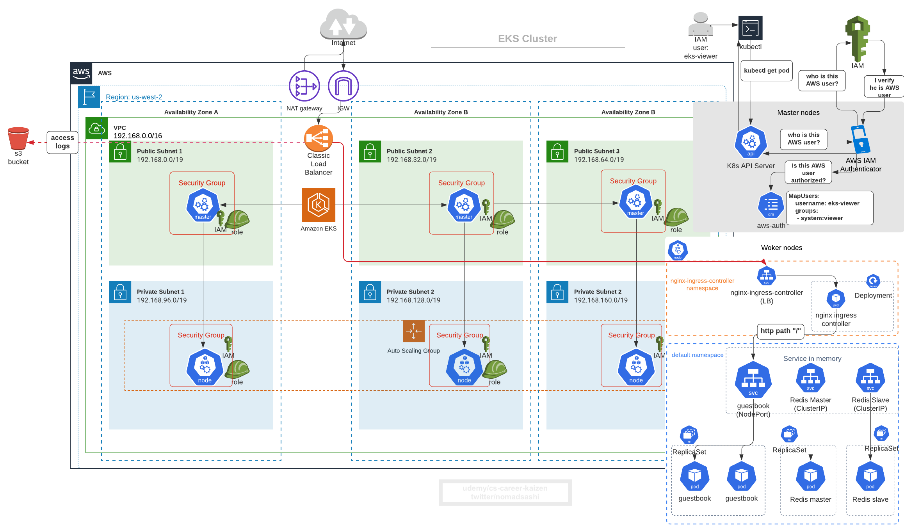
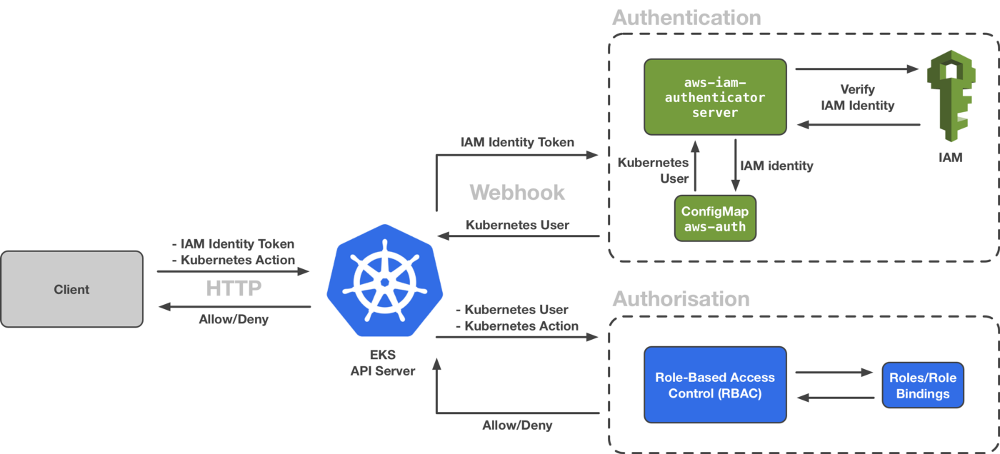
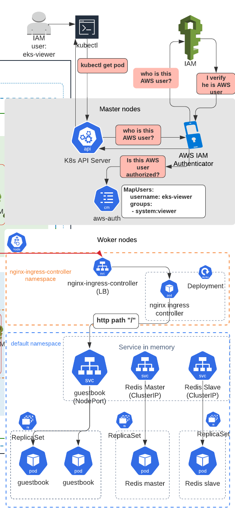

# 7. Security: User Authentication (aws-iam-authenticator) and Authorization (RBAC: Role Based Access Control)




# 7.1 AWS IAM User Authentication to K8s Cluster Process Breakdown



1. `kubectl ...` command sends a request to API server in K8s master node. `kubectl` will by default send authentication token stored in `~/.kube/config` (for AWS EKS, the token is AWS IAM user ARN or IAM Role ARN)
2. API server will pass along the token to `aws-iam-authenticator` server in the cluster, which in turn will ask AWS IAM about the user's identity
3. Once `aws-iam-authenticator` receives a response from AWS IAM, it'll check `aws-auth` configmap in `kube-system` namespace to see if the verified AWS IAM user is bound to any k8s roles 
4. API servier will approve and execute actions, or decline (“You must be logged in to the server (Unauthorized)”) response to kubectl client


# 7.2 Kubeconfig and aws-auth ConfigMap
```
kubectl config view
```

Output
```
users:
- name: 1592048816494086000@eks-from-eksctl.us-west-2.eksctl.io
  user:
    exec:
      apiVersion: client.authentication.k8s.io/v1alpha1
      args:
      - token
      - -i
      - eks-from-eksctl
      command: aws-iam-authenticator
      env:
      - name: AWS_STS_REGIONAL_ENDPOINTS
        value: regional
      - name: AWS_DEFAULT_REGION
        value: us-west-2
```

Get `aws-auth` configmap which is a map of AWS IAM user or IAM role ARNs who are admitted to EKS cluster
```
kubectl get configmap aws-auth -n kube-system -o yaml
```

Output
```yaml
apiVersion: v1
data:
  mapRoles: |
    - groups:
      - system:bootstrappers
      - system:nodes
      rolearn: arn:aws:iam::xxxxxxxx:role/eksctl-eks-from-eksctl-nodegroup-NodeInstanceRole-R3EFEQC9U6U
      username: system:node:{{EC2PrivateDNSName}}
kind: ConfigMap
metadata:
  creationTimestamp: "2020-06-13T12:01:54Z"
  name: aws-auth
  namespace: kube-system
  resourceVersion: "666"
  selfLink: /api/v1/namespaces/kube-system/configmaps/aws-auth
  uid: 37b70aec-2c62-4010-956b-b3b7cd473f61
```

You see in 
```yaml
mapRoles: |
    - groups:   # K8s User Group which is tied to ClusterRole
      - system:bootstrappers 
      - system:nodes
      rolearn: arn:aws:iam::xxxxxxxx:role/eksctl-eks-from-eksctl-nodegroup-NodeInstanceRole-R3EFEQC9U6U  # AWS IAM user
      username: system:node:{{EC2PrivateDNSName}} 
```
that 
1. `rolearn: arn:aws:iam::xxxxxxxx:role/eksctl-eks-from-eksctl-nodegroup-NodeInstanceRole-R3EFEQC9U6U` has new k8s username `system:node:{{EC2PrivateDNSName}}` 
2. and it is added into list of groups `system:bootstrappers` and `system:nodes`.


# 7.3 Create New AWS IAM User

1. Create new AWS IAM user from IAM console with AWS access key and secret access key

2. Add named AWS profile to `~/.aws/credentials` and save AWS access key and secret access key
```
vim ~/.aws/credentials
```

```
[eks-viewer]
aws_access_key_id = REDUCTED
aws_secret_access_key = REDUCTED
region = us-west-2

[eks-editor]
aws_access_key_id = REDUCTED
aws_secret_access_key = REDUCTED
region = us-west-2

[eks-admin]
aws_access_key_id = REDUCTED
aws_secret_access_key = REDUCTED
region = us-east-1
```

Check each user's access
```
export AWS_PROFILE=eks-viewer
aws sts get-caller-identity
```

Successful output
```json
{
    "UserId": "REDUCTED",
    "Account": "xxxxx",
    "Arn": "arn:aws:iam::xxxx:user/eks-viewer"
}
```

```
export AWS_PROFILE=eks-editor
aws sts get-caller-identity

export AWS_PROFILE=eks-admin
aws sts get-caller-identity
```

Lastly, to do K8s admin operations, swtich back to the original AWS PROFILE you were using.


# 7.4 Allow AWS IAM Users to K8s Cluster with Root Access (Don't do this!)

Refs: 
- https://docs.aws.amazon.com/eks/latest/userguide/add-user-role.html
- https://kubernetes.io/docs/reference/access-authn-authz/rbac/#user-facing-roles

```
kubectl edit -n kube-system configmap/aws-auth
```

Add this section to `aws-auth` configmap to add new AWS IAM user
```yaml
mapUsers: |
    - userarn: arn:aws:iam::111122223333:user/eks-viewer   # AWS IAM user
      username: this-aws-iam-user-name-will-have-root-access
      groups:
      - system:masters  # K8s User Group
```

Check edited content is correct by printing out yaml 
```bash
$ kubectl get -n kube-system configmap/aws-auth -o yaml

# output
apiVersion: v1
data:
  mapRoles: |
    - groups:
      - system:bootstrappers
      - system:nodes
      rolearn: arn:aws:iam::xxxxxxxxxxx:role/eksctl-eks-from-eksctl-nodegroup-NodeInstanceRole-R3EFEQC9U6U
      username: system:node:{{EC2PrivateDNSName}}
  mapUsers: |
    - userarn: arn:aws:iam::xxxxxxxxxxxxx:user/eks-viewer
      username: this-aws-iam-user-name-will-have-root-access
      groups:
      - system:masters  # <-------- this is really BAD!
kind: ConfigMap
metadata:
  creationTimestamp: "2020-06-13T12:01:54Z"
  name: aws-auth
  namespace: kube-system
  resourceVersion: "40749"
  selfLink: /api/v1/namespaces/kube-system/configmaps/aws-auth
```

Check if AWS IAM user `eks-viewer` can now view K8s cluster
```sh
# switch AWS IAM user by changing AWS profile
export AWS_PROFILE=eks-viewer

# do some READ/GET operations with kubectl
kubectl get pod
NAME                 READY   STATUS    RESTARTS   AGE
guestbook-dxkpd      1/1     Running   0          4h6m
guestbook-fsqx8      1/1     Running   0          4h6m
guestbook-nnrjc      1/1     Running   0          4h6m
redis-master-6dbj4   1/1     Running   0          4h8m
redis-slave-c6wtv    1/1     Running   0          4h7m
redis-slave-qccp6    1/1     Running   0          4h7m
```

Check authorization of this AWS IAM user `eks-viewer`, bound to K8s user group `system:masters`
```
$ kubectl auth can-i create deployments
yes

$ kubectl auth can-i delete deployments
yes

$ kubectl auth can-i delete ClusterRole
yes
```

This AWS IAM user is bound to K8s user group called `system:masters`
```yaml
mapUsers: |
    - userarn: arn:aws:iam::111122223333:user/eks-viewer   # AWS IAM user
      username: this-aws-iam-user-name-will-have-root-access
      groups: 
      - system:masters  # K8s User Group
```

But __this is not recommended__ because `system:masters` has admin access to K8s resources (not AWS resources)
```sh
# check "cluster-admin" ClusterRoleBinding
$ kubectl get clusterrolebindings/cluster-admin -o yaml

# output
apiVersion: rbac.authorization.k8s.io/v1
kind: ClusterRoleBinding
metadata:
  annotations:
    rbac.authorization.kubernetes.io/autoupdate: "true"
  creationTimestamp: "2020-06-13T11:57:34Z"
  labels:
    kubernetes.io/bootstrapping: rbac-defaults
  name: cluster-admin
  resourceVersion: "104"
  selfLink: /apis/rbac.authorization.k8s.io/v1/clusterrolebindings/cluster-admin
  uid: b2905280-b865-4ede-b256-7ed39873e1eb
roleRef:
  apiGroup: rbac.authorization.k8s.io
  kind: ClusterRole
  name: cluster-admin  # <-------  bound to ClusterRole "cluster-admin"
subjects:
- apiGroup: rbac.authorization.k8s.io
  kind: Group
  name: system:masters # <-------  k8s user group name
```


This breaks the principle of least priviledge.

To assoicate AWS IAM user to right K8s user group, create K8s ClusterRoleBinding.

# 7.5 Restrict K8s User Access by Creating ClusterRoleBinding (RBAC - Role Based Access Control)

Refs: 
- https://kubernetes.io/docs/reference/access-authn-authz/rbac/#user-facing-roles
- https://github.com/kubernetes-sigs/aws-iam-authenticator/issues/139#issuecomment-417400851

There are some default K8s ClusterRole in `kube-system`, such as `edit`, `view`, etc

Get a whole list
```
kubectl get clusterrole -n kube-system
````

Show details of permissions for `edit` ClusterRole
```
kubectl describe clusterrole edit -n kube-system
```

Output
```sh
Name:         edit
Labels:       kubernetes.io/bootstrapping=rbac-defaults
              rbac.authorization.k8s.io/aggregate-to-admin=true
Annotations:  rbac.authorization.kubernetes.io/autoupdate: true
PolicyRule:
  Resources                                    Non-Resource URLs  Resource Names  Verbs
  ---------                                    -----------------  --------------  -----
  configmaps                                   []                 []              [create delete deletecollection patch update get list watch]
  endpoints                                    []                 []              [create delete deletecollection patch update get list watch]
.
.
.
  resourcequotas                               []                 []              [get list watch]
  services/status                              []                 []              [get list watch]
  controllerrevisions.apps                     []                 []              [get list watch]
  daemonsets.apps/status                       []                 []              [get list watch]
  deployments.apps/status                      []                 []              [get list watch]
  deployments.extensions/status                []                 []              [get list watch]
  ingresses.extensions/status                  []                 []              [get list watch]                     []                 []              [get list watch]
  pods.metrics.k8s.io                          []                 []              [get list watch]
  ingresses.networking.k8s.io/status           []                 []              [get list watch]
  poddisruptionbudgets.policy/status           []                 []              [get list watch]
  serviceaccounts                              []                 []              [impersonate create delete deletecollection patch update get list watch]
```

This clusterrole isn't bound to any K8s user __yet__. To attach this `edit` ClusterRole to a new K8s user `system:editor`, create `ClusterRoleBinding`.

Generate yaml file 
```sh
# bind ClusterRole "edit" to a new K8s user group "system:editor" by creating ClusterRoleBinding
kubectl create clusterrolebinding system:editor \
    --clusterrole=edit \
    --group=system:editor \
    --dry-run -o yaml > clusterrolebinding_system_editor.yaml

cat clusterrolebinding_system_editor.yaml
```

Output
```yaml
apiVersion: rbac.authorization.k8s.io/v1beta1
kind: ClusterRoleBinding
metadata:
  creationTimestamp: null
  name: system:editor
roleRef:
  apiGroup: rbac.authorization.k8s.io
  kind: ClusterRole  
  name: edit  # K8s ClusterRole name
subjects:
- apiGroup: rbac.authorization.k8s.io
  kind: Group
  name: system:editor  # K8s User Group
``` 

Apply
```
kubectl apply -f clusterrolebinding_system_editor.yaml
```

Check ClusterRoleBinding `system:editor` is bound to ClusterRole `edit`
```
$ kubectl describe clusterrolebinding system:editor 

Name:         system:editor
Labels:       <none>
Annotations:  kubectl.kubernetes.io/last-applied-configuration:
                {"apiVersion":"rbac.authorization.k8s.io/v1beta1","kind":"ClusterRoleBinding","metadata":{"annotations":{},"creationTimestamp":null,"name"...
Role:
  Kind:  ClusterRole
  Name:  edit
Subjects:
  Kind   Name           Namespace
  ----   ----           ---------
  Group  system:editor  
```

Do the same for bindig ClusterRole `view` with ClusterRoleBinding `system:viewer`
```
kubectl create clusterrolebinding system:viewer \
    --clusterrole=view \
    --group=system:viewer \
    --dry-run -o yaml > clusterrolebinding_system_viewer.yaml

cat clusterrolebinding_system_viewer.yaml
```

Output
```
apiVersion: rbac.authorization.k8s.io/v1beta1
kind: ClusterRoleBinding
metadata:
  creationTimestamp: null
  name: system:viewer
roleRef:
  apiGroup: rbac.authorization.k8s.io
  kind: ClusterRole
  name: view
subjects:
- apiGroup: rbac.authorization.k8s.io
  kind: Group
  name: system:viewer
```

Apply
```
kubectl apply -f clusterrolebinding_system_viewer.yaml
```

# 7.6 Restrict AWS IAM User Access by Binding them to Right K8s User Groups (which is bound to right ClusterRole)

Swtich back to the original AWS PROFILE first.
```sh
export AWS_PROFILE=YOUR_ORIGINAL_PROFILE
```

Then edit configmap
```
kubectl edit -n kube-system configmap/aws-auth
```

This time, instead of specifying `system:masters`, use `system:viewer` K8s user group created from new ClusterRoleBinding `system:viewer`
```yaml
mapUsers: |
    - userarn: arn:aws:iam::111122223333:user/eks-viewer  # AWS IAM User
      username: eks-viewer
      groups:
      - system:viewer  # K8s User Group which is tied to ClusterRole
```

Check if AWS IAM user `eks-viewer` can now view K8s cluster
```sh
# switch AWS IAM user by changing AWS profile
export AWS_PROFILE=eks-viewer

# do some READ/GET operations with kubectl
kubectl get pod
NAME                 READY   STATUS    RESTARTS   AGE
guestbook-dxkpd      1/1     Running   0          4h6m
guestbook-fsqx8      1/1     Running   0          4h6m
guestbook-nnrjc      1/1     Running   0          4h6m
redis-master-6dbj4   1/1     Running   0          4h8m
redis-slave-c6wtv    1/1     Running   0          4h7m
redis-slave-qccp6    1/1     Running   0          4h7m
```

Check authorization of this AWS IAM user `eks-viewer`, bound to K8s user group `system:viewer`
```
$ kubectl auth can-i create deployments
no

$ kubectl auth can-i delete deployments
no

$ kubectl auth can-i delete ClusterRole
no
```

If you try to create, you will get an expected permission error because `eks-viewer` AWS IAM user is bound to `system:viewer` K8s user group, which has only `view` ClusterRole permissions
```
# try to create namespace
$ kubectl create namespace test

Error from server (Forbidden): namespaces is forbidden: User "eks-viewer" cannot create resource "namespaces" in API group "" at the cluster scope
```


Now add AWS IAM user `eks-editor` and bind it to K8s user group `system:editor`.

```sh
# switch to the original AWS Profile first
export AWS_PROFILE=YOUR_ORIGINAL_PROFILE

kubectl edit -n kube-system configmap/aws-auth
```

This time, instead of specifying `system:masters`, use `system:viewer` K8s user group created from new ClusterRoleBinding `system:viewer`
```yaml
mapUsers: |
    - userarn: arn:aws:iam::xxxxxxxxx:user/eks-viewer # AWS IAM User
      username: eks-viewer
      groups:
      - system:viewer  # K8s User Group
    - userarn: arn:aws:iam::xxxxxxxxxxx:user/eks-editor # AWS IAM User
      username: eks-editor
      groups:
      - system:editor  # K8s User Group
```

Check if AWS IAM user `eks-editor` can now view K8s cluster
```sh
# switch AWS IAM user by changing AWS profile
export AWS_PROFILE=eks-editor

# do some READ/GET operations with kubectl
kubectl get pod
NAME                 READY   STATUS    RESTARTS   AGE
guestbook-dxkpd      1/1     Running   0          4h6m
guestbook-fsqx8      1/1     Running   0          4h6m
guestbook-nnrjc      1/1     Running   0          4h6m
redis-master-6dbj4   1/1     Running   0          4h8m
redis-slave-c6wtv    1/1     Running   0          4h7m
redis-slave-qccp6    1/1     Running   0          4h7m
```

Check authorization of this AWS IAM user `eks-editor`, bound to K8s user group `system:editor`
```
$ kubectl auth can-i create deployments
yes

$ kubectl auth can-i delete deployments
yes

$ kubectl auth can-i delete ClusterRole
no

$ kubectl auth can-i create namespace
no
```

## What Just Happened?



# 7.7 Allow AWS IAM Role to K8s Cluster

In reality, AWS IAM user should be assuming roles because IAM role's temporary credentials get rotated every hour or so  and thus safer.

To allow AWS IAM role to K8s, simply add IAM Role ARNs to `aws-auth` configmap
```yaml
apiVersion: v1
kind: ConfigMap
metadata:
  name: aws-auth
  namespace: kube-system
data:
  mapRoles: |
    - groups:
      - system:bootstrappers
      - system:nodes
      rolearn: arn:aws:iam::xxxxxxxx:role/eksctl-eks-from-eksctl-nodegroup-NodeInstanceRole-R3EFEQC9U6U
      username: system:node:{{EC2PrivateDNSName}}
    - groups:  # <----- new IAM role entry
      - system:viewer  # <----- K8s User Group
      rolearn: arn:aws:iam::xxxxxxxx:role/eks-viewer-role  # AWS IAM role
      username: eks-viewer
    - groups:  # <----- new IAM role entry
      - system:editor   # <----- K8s User Group
      rolearn: arn:aws:iam::xxxxxxxx:role/eks-editor-role  # AWS IAM role
      username: eks-editor
  # it's best practice to use IAM role rather than IAM user's access key
  # mapUsers: |
  #   - userarn: arn:aws:iam::xxxxxxxxx:user/eks-viewer
  #     username: eks-viewer
  #     groups:
  #     - system:viewer
  #   - userarn: arn:aws:iam::xxxxxxxx:user/eks-editor
  #     username: eks-editor
  #     groups:
  #     - system:editor
```