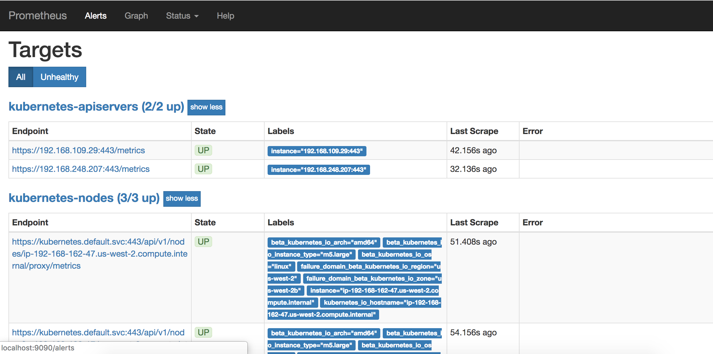

# 8. Monitoring: Prometheus and Grafana

# Quick Overview of Prometheus Architecture


# Install Prometheus using Helm Chart
Install Prometheus 
```bash
# first create namespace since helm chart doesn't
kubectl create namespace prometheus

helm install prometheus stable/prometheus \
    --namespace prometheus \
    --set alertmanager.persistentVolume.storageClass="gp2" \
    --set server.persistentVolume.storageClass="gp2"
```

Output
```sh
NAME: prometheus
LAST DEPLOYED: 
NAMESPACE: prometheus
STATUS: deployed
REVISION: 1
TEST SUITE: None
NOTES:
The Prometheus server can be accessed via port 80 on the following DNS name from within your cluster:
prometheus-server.prometheus.svc.cluster.local


The Prometheus PushGateway can be accessed via port 9091 on the following DNS name from within your cluster:
prometheus-pushgateway.prometheus.svc.cluster.local


Get the Prometheus server URL by running these commands in the same shell:
  export POD_NAME=$(kubectl get pods --namespace prometheus -l "app=prometheus,component=server" -o jsonpath="{.items[0].metadata.name}")
  kubectl --namespace prometheus port-forward $POD_NAME 9090
```

You can see objects created
```
kubectl get pods,deploy,svc,serviceaccount -n prometheus
```

You will see that there are `alertmanager`, `kube-state-metrics`, `pushgateway`, and `prometheus-server` deployments
```
NAME                                                  READY   UP-TO-DATE   AVAILABLE   AGE
deployment.extensions/prometheus-alertmanager         1/1     1            1           5m28s
deployment.extensions/prometheus-kube-state-metrics   1/1     1            1           5m28s
deployment.extensions/prometheus-pushgateway          1/1     1            1           5m28s
deployment.extensions/prometheus-server               1/1     1            1           5m28s
```

Start a proxy from kubectl to K8s api server using kubectl's token for authentication
```sh
export POD_NAME=$(kubectl get pods --namespace prometheus -l "app=prometheus,component=server" -o jsonpath="{.items[0].metadata.name}")

kubectl --namespace prometheus port-forward $POD_NAME 9090

# visit from browser
http://127.0.0.1:9090/
```

In the web UI, you can see all the targets and metrics being monitored by Prometheus:




# Install Grafana via Helm Chart
install it
```
# first create namespace since helm chart doesn't
kubectl create namespace grafana

helm install grafana stable/grafana \
    --namespace grafana \
    --set persistence.storageClassName="gp2" \
    --set persistence.enabled=true \
    --set adminPassword='EKS!sAWSome' \
    --set datasources."datasources\.yaml".apiVersion=1 \
    --set datasources."datasources\.yaml".datasources[0].name=Prometheus \
    --set datasources."datasources\.yaml".datasources[0].type=prometheus \
    --set datasources."datasources\.yaml".datasources[0].url=http://prometheus-server.prometheus.svc.cluster.local \
    --set datasources."datasources\.yaml".datasources[0].access=proxy \
    --set datasources."datasources\.yaml".datasources[0].isDefault=true \
    --set service.type=ClusterIP
```

Output
```
NAME: grafana
LAST DEPLOYED: Sun Jun 14 02:24:33 2020
NAMESPACE: grafana
STATUS: deployed
REVISION: 1
NOTES:
1. Get your 'admin' user password by running:

   kubectl get secret --namespace grafana grafana -o jsonpath="{.data.admin-password}" | base64 --decode ; echo

2. The Grafana server can be accessed via port 80 on the following DNS name from within your cluster:

   grafana.grafana.svc.cluster.local

   Get the Grafana URL to visit by running these commands in the same shell:

     export POD_NAME=$(kubectl get pods --namespace grafana -l "app=grafana,release=grafana" -o jsonpath="{.items[0].metadata.name}")
     kubectl --namespace grafana port-forward $POD_NAME 3000

3. Login with the password from step 1 and the username: admin
```

You can see objects created
```
kubectl get pods,deploy,svc,serviceaccount -n grafana
```

Start a proxy from kubectl to K8s api server using kubectl's token for authentication
```sh
# get Grafana password
kubectl get secret --namespace grafana grafana -o jsonpath="{.data.admin-password}" | base64 --decode ; echo


export POD_NAME=$(kubectl get pods --namespace grafana -o jsonpath="{.items[0].metadata.name}")

kubectl --namespace grafana port-forward $POD_NAME 3000
```

# Grafana Dashboard Walkthrough
Create kubernetes dashboard on grafana by:
+ icon > type `3119` dashboard ID > Select ‘Prometheus’ as the endpoint under prometheus data sources drop down.


In the web UI, you can see all the targets and metrics being monitored by grafana:


# Practically useful Grafana community dashboards 

- [K8 Cluster Detail Dashboard](https://grafana.com/grafana/dashboards/10856)
- [K8s Cluster Summary](https://grafana.com/grafana/dashboards/8685)
- [Kubernetes cluster monitoring](https://grafana.com/grafana/dashboards/315)


# Uninstall 
```
helm uninstall prometheus -n prometheus
helm uninstall grafana -n grafana
```