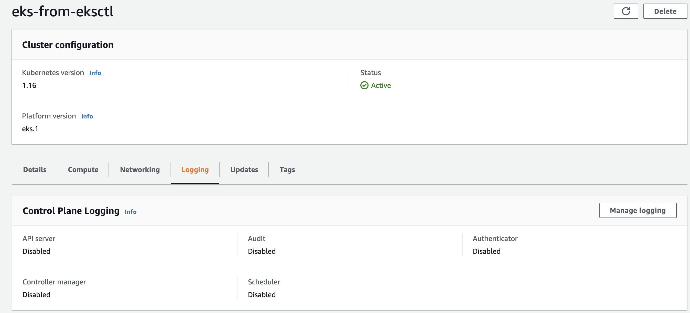
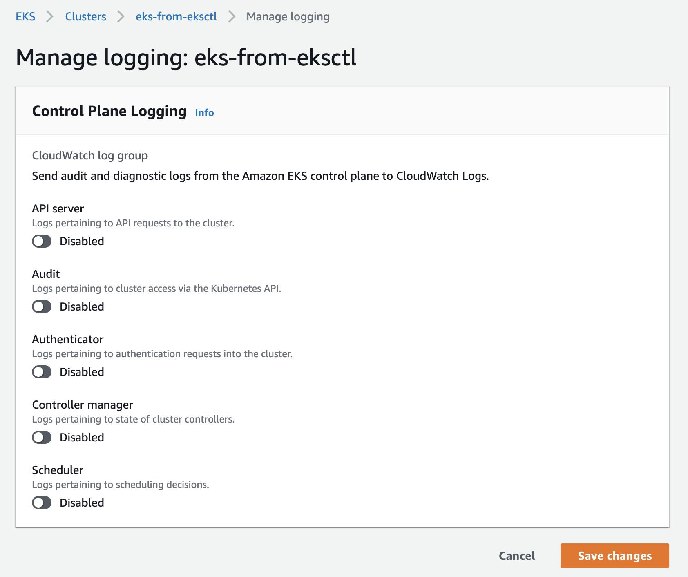
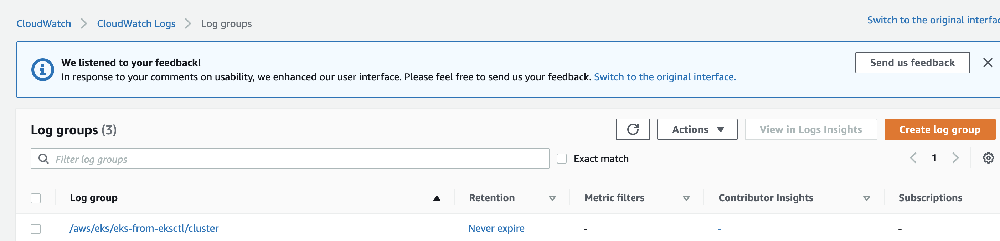
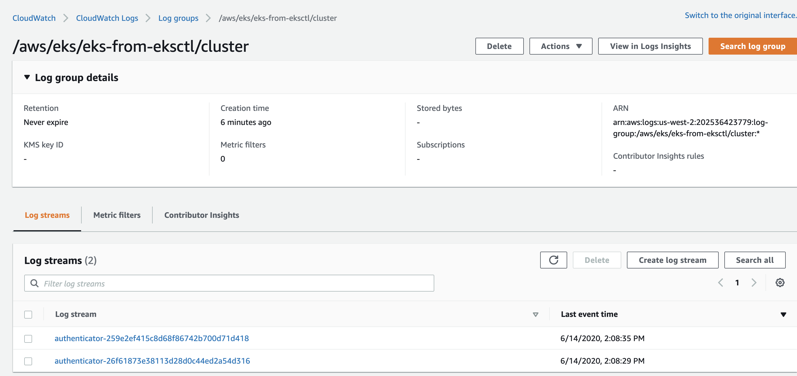
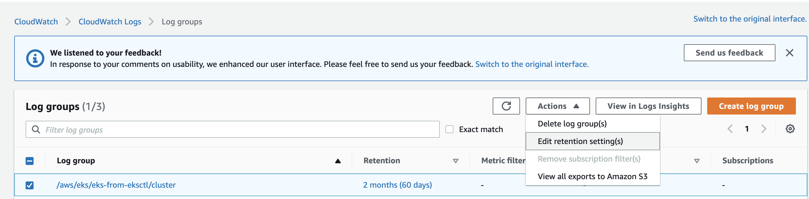

# 9. EKS Cluster Logging: Enable Master Components Logging

# 9.1 Enable Master Component Logging from EKS Console



# 9.2 Check Logs in CloudWatch Log
You should see a log entry from `aws-iam-authenticator` in CloudWatch Log
```log
2020-06-14T14:12:39.465+07:00
time="2020-06-14T07:12:39Z" level=info msg="STS response" accesskeyid=xxxxxxxx accountid=xxxxxxxxx arn="arn:aws:sts::xxxxxxxxx:assumed-role/SOME_ROLE/1592118757435271000" client="127.0.0.1:44818" method=POST path=/authenticate session=1592118757435271000 userid=xxxxxxx
```





# 9.3 Set CloudWatch Log Retention Period for cost saving
