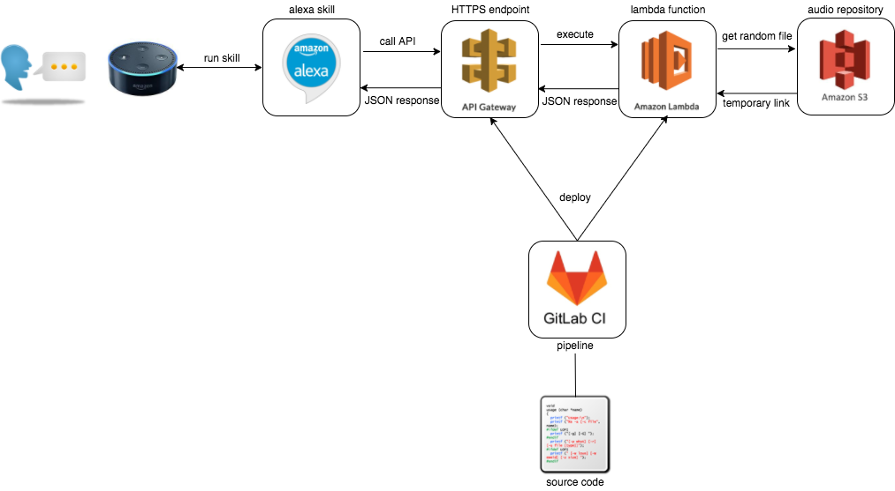
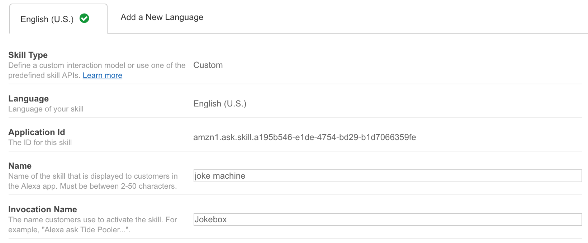
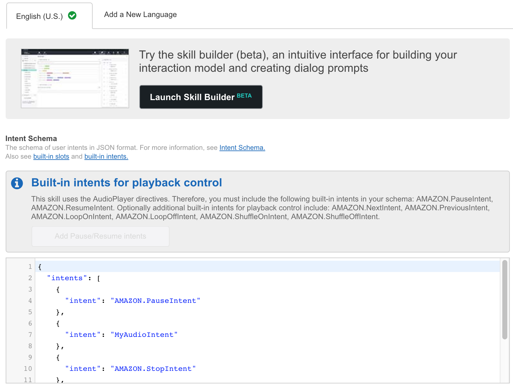
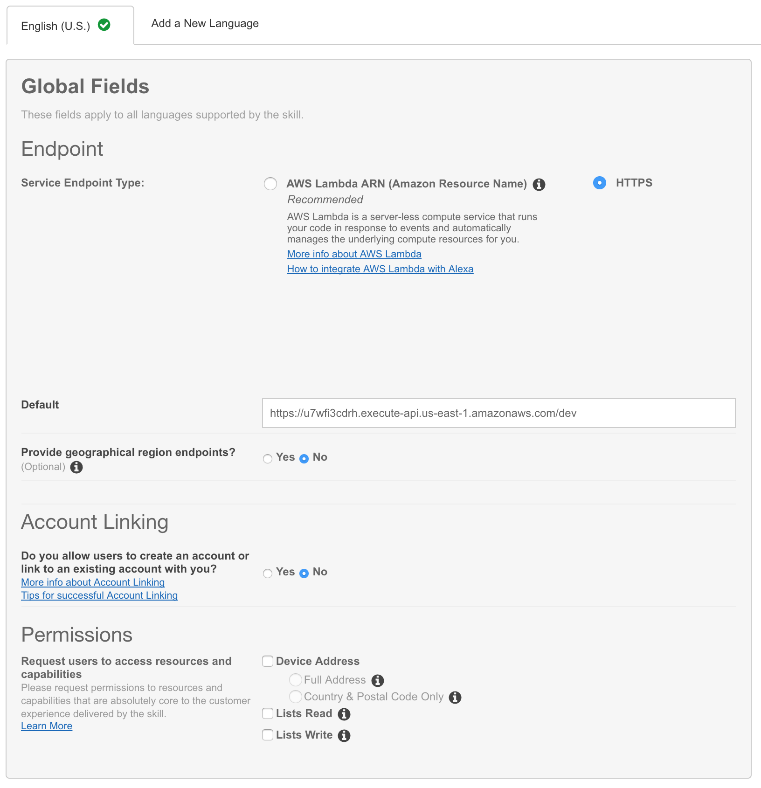
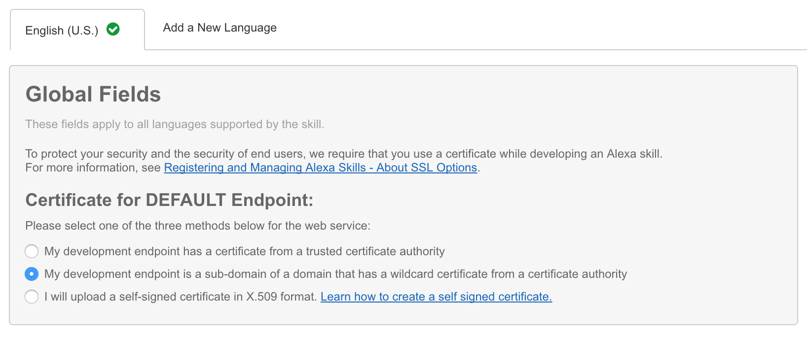

# Lambda Flask-Ask Jokebox

- [Intro](#lambda-flask-ask-jokebox)
- [How does it work?](#how-does-it-work)
- [Source Code](#source-code)
- [Code Deployment](#code-deployment)
- [Alexa Skill](#alexa-skill)
- [Pipeline](#pipeline)

I just bought an Amazon Echo device, yay!! 🙂, but turns out that all supported _channels_ (called "Skills" in here) are made for English, German or Japanese languages 👎. Since I'm a Spanish speaker, I had the perfect excuse to learn how to deploy my own custom Skill.

Digging a little bit about the Alexa Skills Kit (Ask) architecture ([doc](https://www.slideshare.net/aniruddha.chakrabarti/amazon-alexa-building-custom-skills)), designing a custom Skill sounded a little bit complicated given the structure of messages to be parsed and replied back to our device, as well as identifying what are we speaking to/from our device.

Turns out that digging a little bit more, I found some tools that make your life way easier. Based on this [excellent documentation](https://developer.amazon.com/blogs/post/8e8ad73a-99e9-4c0f-a7b3-60f92287b0bf/new-alexa-tutorial-deploy-flask-ask-skills-to-aws-lambda-with-zappa) I created my own Serverless Alexa Skill using Lambda functions, deployed from a Python script using [Flask-Ask](https://github.com/johnwheeler/flask-ask) and [Zappa](https://github.com/Miserlou/Zappa).

The _final product_ is a cost-effective and scalable service which runs any custom audio in any language. In my personal case I configured this Skill to play joke audio files in Spanish (stored in S3), but it can be adapted to play any kind of audio (news, weather, podcasts, etc.). Let's check it how it's done.

## How does it work?



How does this skill work? **as simple as**:

1. A user invokes a custom Alexa skill with his/her voice,
1. Our custom skill is configured to call an HTTPS API,
1. Our API calls a Lambda function,
1. Our Lambda function runs a python script to fetch a random audio from an S3 bucket,
1. Our Lambda function receives a temporary HTTPS link to download the audio file, generating a JSON response for the Alexa device,
1. The Alexa device plays the audio file.

The cool part of this, is that all this sequence happen in a quarter of a second, with no permanent infrastructure. Using Lambda functions bring millisecond, infinite-scaling and cost-effective applications (cheap!).

S3 files were uploaded manually beforehand, and named using an `uuid` (just to be cool... don't really need it because they are randomly accesed by now):

```
...
fe00077d-637c-497f-bf43-3a824a8d00e0.mp3
fed78dae-dd8c-4ff9-b7c6-43e9c815cf37.mp3
fee56300-97cd-4c5d-9f91-a21f4308031b.mp3
...
```

On the other hand, to update our Lambda function I defined a small pipeline that deploys our python code as a serverless function using Zappa library.

Let's review a few key concepts briefly, just to be on the same page before looking Source Code and Configurations:

- [Lambda](https://aws.amazon.com/lambda/): the core service behind this Skill, allows us to **create applications as functions**. These functions do not depend of an application server or any infrastructure, meaning that you just will take care of coding functionalities, supporting several languages like NodeJS, Python, Java, and Go. AWS takes care about underlying infrastructure aspects, like security, scalability, utilization, etc.

- [Ask](https://developer.amazon.com/alexa-skills-kit): stands for Alexa Skill Kit, and allows us to create our own _channels_ to interact with out Alexa device (e.g. Echo Dot) to perform custom tasks like audio players, helpdesks or chatbots.

- [Flask](http://flask.pocoo.org/): is a python micro-framework that allows us to create web applications/APIs with extremely ease:

  ```python
  from flask import Flask
  app = Flask(__name__)

  @app.route("/")
  def hello():
      return "Hello World!"
  ```

  With these 5 lines of code we create a new application listening to `http://localhost:5000/`, with an API saying "Hello World!".

- [Flask-Ask](https://github.com/johnwheeler/flask-ask): is the library that integrates the creation of APIs compatible with Alexa, abstracting developers of defining the right structure to speak and listen an Alexa device (which internally speaks/understands JSON calls):

  ```python
  from flask import Flask
  from flask_ask import Ask, statement

  app = Flask(__name__)
  ask = Ask(app, '/')

  @ask.intent('HelloIntent')
  def hello(firstname):
      speech_text = "Hello %s" % firstname
      return statement(speech_text).simple_card('Hello', speech_text)

  if __name__ == '__main__':
    app.run()
  ```

  With these 10 lines of code we create a custom Alexa Skills function, that handles an Echo call with your name, and responds with a message saying "Hello _your-name_".

- [Zappa](https://github.com/Miserlou/Zappa): allows us to deploy event-driven python applications (WSGI webapps like Flask or Django) as Lambda functions. It solves the problem of hosting a Flask-Ask application on a physical server with an SSL certificate, using AWS Lambda and API Gateway.

  ```bash
  $ pip install zappa
  $ zappa init
  $ zappa deploy production
  ```

  These 3 commands allows us to install Zappa, initialize our Flask/Django project with AWS configurations, and deploy our new Lambda function to Production.

## Source Code

The core part of this Skill is a Lambda function, so let's review our [Python source code](https://gitlab.com/nicosingh/serverless-functions/raw/master/sin-censura-jokes/sin-censura.py) step by step.

The first step is creating a Flask-Ask application. The following code creates an empty Flask-Ask application (by default, listening on port 5000):

```python
import boto3
import logging
import os
import feedparser
from random import randint
from flask import Flask, json, render_template
from flask_ask import Ask, request, session, question, statement, context, audio, current_stream

# create app
app = Flask(__name__)
ask = Ask(app, "/")
logger = logging.getLogger()
logging.getLogger('flask_ask').setLevel(logging.DEBUG)

if __name__ == '__main__':
  if 'ASK_VERIFY_REQUESTS' in os.environ:
    verify = str(os.environ.get('ASK_VERIFY_REQUESTS', '')).lower()
    if verify == 'false':
      app.config['ASK_VERIFY_REQUESTS'] = False
  app.run(debug=True)
```

The next step is to create a function to fetch a random audio file from S3. I used [Boto3](https://boto3.readthedocs.io/en/latest/) library to interact in python with my S3 buckets:

```python
# function to get random audio file from S3
def getRandomAudio():
    # get all files from our bucket
    bucket_name = os.environ.get("audio_bucket")
    objects = s3.list_objects(
        Bucket=bucket_name
    )
    bucket_files = objects['Contents']
    # pick a random file from our bucket
    random_index = randint(0,len(bucket_files)-1)
    random_file = bucket_files[random_index]['Key']
    # generate pre-signed url for our picked file
    signed_url = s3.generate_presigned_url(
        ClientMethod = "get_object",
        ExpiresIn = 60,
        Params = {
            "Bucket": bucket_name,
            "Key": random_file
        }
    )
    # finish
    return signed_url
```

As you can see at the end of the function, we generate a pre-signed URL for the S3 file to be downloaded with an expiration period. The idea is to protect our S3 bucket contents, blocking public access to our audio files, allowing them to be downloaded only by this function within a 60-second period.

The final step is to define some functions required to create an Alexa Audio Skill: **Play, Pause, Resume and Stop**:

```python
@ask.intent('AMAZON.PauseIntent')
def pause():
  return audio('Pausing.').stop()

@ask.intent('AMAZON.ResumeIntent')
def resume():
  return audio('Resuming.').resume()

@ask.intent('AMAZON.StopIntent')
def stop():
  return audio('Stopping.').clear_queue(stop=True)

# run my custom intent
@ask.intent('TellMeAJokeIntent')
def playRandomAudio():
  # get welcome message from template
  speech = render_template('welcome_message')
  logger.debug("speech: " + speech)
  # play a random audio file from my S3 bucket
  stream_url = getRandomAudio()
  return audio(speech).play(stream_url)

# alexa, run "your-ask-app"
@ask.launch
def launch():
  return playRandomAudio()
```

`pause()`, `resume()` and `stop()` functions do exactly what they say: pausing, resuming and clearing our Alexa audio queue when asked.

The identification of what action we are performing against a Skill is called **Intent**, and allows the user to perform different actions (speak more than 1 sentence) with one single Alexa Skill. I defined a custom intent called `TellMeAJokeIntent`, which runs by default when we call this Skill on `launch()` function (for example, saying "_Alexa, run Jokebox_").

Additionally, we use [Jinja Templates](http://jinja.pocoo.org/docs/dev/api/#loaders) to define a welcome message to be pronounced by Alexa before playing the audio file. This message is defined as `welcome_message` and is rendered in `playRandomAudio()` function:

```
welcome_message: Here is your random joke from your Jokebox
```
[Jinja Template Source](https://gitlab.com/nicosingh/serverless-functions/raw/master/sin-censura-jokes/templates.yaml)

## Code Deployment

The cool part of using Flask-Ask is that we create an API in minutes, without setting up an application server and configuring ports. The not-so-cool part is that Alexa requires an HTTPS endpoint with a DNS name to talk to our Lambda function. How do we do it, then? we can figure out a few solutions, like:

- Setting up an internet-facing HTTP server and deploy our applications, with SSL/TLS support &rarr; ~~expensive~~
- Deploy our application as a Container, for example using ECS or Kubernetes &rarr; ~~sounds cool~~
- Transform our application to a Lambda function, and expose it publicly &rarr; such wow idea

Here is were [Zappa](https://github.com/Miserlou/Zappa) comes to save the day. Zappa takes our Flask/Django code, uploads our sources as a zipfile to AWS, creates a Lambda function based on this code, and exposes the function using API Gateway (supporting SSL/TLS). Third option is possible! 🎉.

The command `zappa init` will lead us to configure our Zappa deployment(s) through a wizard. It will detect our application source, and prompt us to confirm some information about our deployment (application name, AWS region to deploy and programming language). Once finishing the wizard, a file called `zappa_settings.json` will be created in the root of our project:

```json
{
    "dev": {
        "app_function": "jokebox.app",
        "aws_region": "us-east-1",
        "profile_name": "default",
        "project_name": "jokebox",
        "runtime": "python2.7",
        "s3_bucket": "zappa-jokebox-upload",
        "environment_variables": {
          "audio_bucket": "chistes-sin-censura"
        }
    }
}
```

Where:
- `app_function`: is the name of the Flask-Ask python source code.
- `aws_region`: is the region where the Lambda function will be deployed.
- `project_name`: is the name of the Lambda function and API Gateway resources.
- `runtime`: is the programming language which our app is made.
- `s3_bucket`: is a temporary S3 bucket where our artifacts will be uploaded before going to Lambda + API Gateway. If the bucket does not exist, it will be automatically created.
- `audio_bucket`: is a environment variable used by the application (using `os.environ.get` function) to identify the bucket that contains our audio files. This variable will be configured as environment variable in our Lambda function.

After this file is created, we are ready to deploy our Lambda function. `zappa deploy dev` or `zappa update dev` commands will deploy our Lambda function and generate a random API Gateway URL identified for an environment called `dev` in this case.

**NOTE**: In order to run `zappa deploy` or `zappa update` commands we need to have AWS CLI configured with credentials to deploy (`AdminAccess` is recommended).

That's it! Our Lambda function and HTTPS endpoint is ready. Let's move to the configuration of our Alexa Skill to call this new function.

## Alexa Skill

To create an Alexa Skill that calls our Lambda function, we have to do the following steps:

1. Enable Developer Access to our Amazon Account

1. Go to https://developer.amazon.com, log in, and then select "Alexa" menu

1. Click on "Add a New Skill" button

1. Define our Skill Information:
  - **Name**: the name of our custom Skill.
  - **Invocation Name**: the name which our custom Skill will be invoked (can be more than 1 word). For example, if we want to invoke this function saying "_Alexa, run Jokebox_", this field should be "_Jokebox_".
  - **Audio Player**: in order to enable audio features in our skill (i.e. play mp3 files), we have to select this option.

  

1. Define Interaction model, using [IntentSchema.json](https://gitlab.com/nicosingh/serverless-functions/raw/master/sin-censura-jokes/IntentSchema.json) and [SampleUtterances.txt](https://gitlab.com/nicosingh/serverless-functions/raw/master/sin-censura-jokes/SampleUtterances.txt) files to get the required Intents and Utterances managed by this python application

  

1. Configure our Skill to use our API Gateway endpoint

  

1. Set up SSL to use wildcard certificate

  

That's it! now you can use your skill from your Alexa device saying "_Alexa, run Jokebox_".

## Pipeline

Laziness leads to automation, and automation leads to speed and less errors. That's why I created a small [GitlabCI](https://about.gitlab.com/features/gitlab-ci-cd/) pipeline to deploy this application in AWS using Zappa. Let's review each step:

```yaml
image: python:2.7.14

before_script:
  - pip install awscli virtualenv
  - aws configure set aws_access_key_id $ACCESS_KEY_ID
  - aws configure set aws_secret_access_key $ACCESS_SECRET_KEY

stages:
  - deploy

jokebox-dev:
  stage: deploy
  script:
    - virtualenv jokebox/
    - cd jokebox/
    - source bin/activate
    - pip install -r requirements.txt
    - zappa update dev

```

This pipeline is composed (so far) by 1 job called `jokebox-dev`, that:

- is based in python image (useful to have pip, virtualenv and zappa).
- imports an authorized AWS account to deploy new Lambda functions using [AWS CLI](https://docs.aws.amazon.com/IAM/latest/UserGuide/id_credentials_access-keys.html), using GitlabCI secret environment variables `$ACCESS_KEY_ID` and `$ACCESS_SECRET_KEY`.
- initializes a virtual environment, and installs our Python requirements (specified in requirements.txt).
- deploys our application in AWS using Zappa commands.
